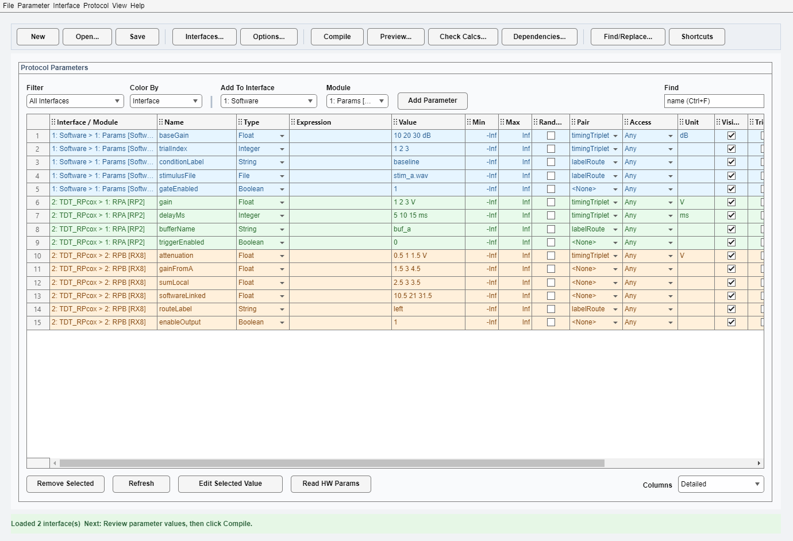
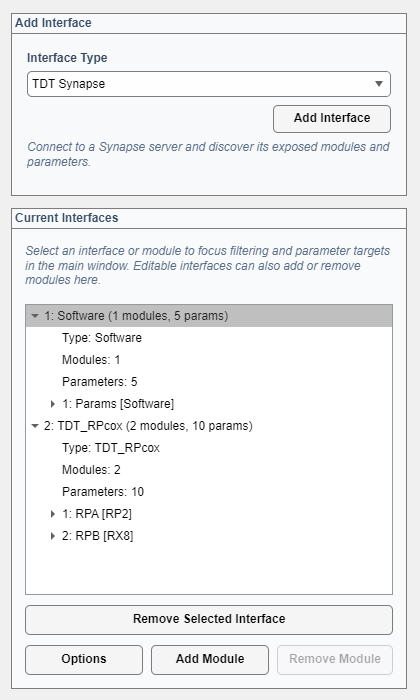

# Protocol Designer User Guide



`epsych.ProtocolDesigner` is the graphical editor for building and checking protocol files without editing MATLAB code directly. Use it to create interfaces, add modules and parameters, adjust protocol settings, and preview the compiled trial list before saving.

The window above shows the toolbar across the top (see [What the window is for](#what-the-window-is-for)) and the **Protocol Parameters** table filling the rest of the window, populated with the parameter rows described in [Adding and editing parameters](#adding-and-editing-parameters).

This guide is written for experiment designers and operators. If you need to change the software itself, use `documentation/design/ProtocolDesigner.md` instead.

## Opening the designer

Open the designer from MATLAB with:

```matlab
ui = epsych.ProtocolDesigner();
```

To open an existing protocol file:

```matlab
ui = epsych.ProtocolDesigner.openFromFile('example.eprot');
```

When the window opens, the message area at the bottom shows the latest action, error, or suggested next step.

## What the window is for

The main window is a toolbar above the **Protocol Parameters** table, where you edit the parameter rows for the selected interface or module.

The toolbar groups the actions you need most, left to right:

| Button | What it does |
|---|---|
| **New**, **Open...**, **Save** | Start, load, and save protocol files |
| **Interfaces...** | Add hardware or software interfaces and manage their modules (Ctrl+Shift+I) |
| **Options...** | Trial function, compile settings, and WAV buffers (Ctrl+Shift+O) |
| **Compile** | Build the trial matrix (Ctrl+Shift+C) |
| **Preview...** | Compile and inspect the resulting trial list (Ctrl+Shift+V) |
| **Check Calcs...** | Sweep expressions across their inputs and check the values (Ctrl+Shift+K) |
| **Dependencies...** | Plot which parameters are calculated from which (Ctrl+Shift+G) |
| **Find/Replace...** | Rename parameters in bulk (Ctrl+H) |
| **Shortcuts** | List every keyboard shortcut |

Each of these dialogs opens in its own window that you can leave open beside the main window while you work. Clicking the same button again brings the existing window back to the front rather than opening a second copy.

Every toolbar action is also on the menus, which hold the less frequently used commands as well. Use the **Help** menu to open this guide or the developer documentation.

## Typical workflow

Most users will follow this order:

1. Click **Interfaces...** and add an interface.
2. Add one or more modules if that interface supports manual module editing.
3. Add parameters to the selected module.
4. Set parameter values, ranges, and any pairings or expressions.
5. Click **Options...** and confirm trial function and timing settings.
6. Click **Compile** or **Preview...** to verify the generated trials.
7. Click **Save** to write the protocol to an `.eprot` file.

## Adding an interface

Click **Interfaces...** on the toolbar to open the Interfaces window, then use its **Add Interface** panel.



1. Choose an interface type from **Interface Type**.
2. Click **Add Interface**.
3. Fill in any required options in the dialog.

If the interface type already exists in the current protocol, the designer prevents adding a duplicate.

Some interfaces are created in an offline or serialized form inside the designer. This is expected. The goal is to define the protocol structure and settings, not to start live hardware communication while editing.

## Managing modules

After an interface is added, it appears in the **Current Interfaces** tree in the same Interfaces window.

- Select an interface to focus the parameter table on that interface.
- Select a module under that interface to focus editing on that module.
- Use **Add Module** and **Remove Module** to manage modules when the selected interface allows it.
- Use **Options** to reopen editable interface settings.

Leave the Interfaces window open beside the main window while you work; the parameter table follows whatever you select in the tree.

Not every interface allows manual module changes. For some hardware-backed interfaces, the module list is controlled by the interface implementation rather than by the designer.

## Adding and editing parameters

Use **Add To Interface** and **Module** above the parameter table to choose where a new parameter will be created, then click **Add Parameter**.

The parameter table includes these main fields:

- `Name`: parameter name
- `Type`: value type such as float, integer, boolean, string, file, or stimulus (StimType)
- `Expression`: optional formula. For numeric and boolean parameters it calculates the value; for string and stimulus (StimType) parameters it instead picks which item in the **Value** list to use
- `Value`: parameter value for editable types
- `Min` and `Max`: numeric limits; values written outside these limits are clamped
- `Random`: whether values are randomized (requires finite Min and Max)
- `Pair`: links parameters so they advance together during compilation
- `Access`: read or write behavior
- `Unit`: display unit shown next to values in GUIs
- `Visible`: whether the parameter is intended to be visible
- `Trigger`: trigger flag for boolean parameters
- `Update Every Trial`: when checked (the default), the value is re-sent to hardware on every trial; uncheck it for settings that should be written once and then hold their value — for example, controls an operator adjusts during a session
- `Description`: free-text note

Important editing rules:

- The **Value** cell is edited directly only for string parameters.
- File parameters open a separate value editor.
- Changing a parameter type may also change or reset the stored value.
- If an edit is invalid, the row is refreshed back to the last valid state and the status line explains the problem.

## Finding parameters by name

The **Find** box above the parameter table narrows the table to the parameters whose
name you are looking for. Press **Ctrl+F** to jump to it. Matching happens as you type:

- Partial names are enough, and case does not matter: `tone` finds `ToneLevel` and `PureToneDur`.
- `*` and `?` are wildcards matched against the whole name: `*Level` finds every name ending
  in `Level`, and `Tone???` finds seven-character names starting with `Tone`.
- Include a dot to search the qualified `Module.Parameter` name, the same form expressions use.

The status bar reports how many parameters matched. The Find box works together with the
**Filter** dropdown, so you can search within a single interface. Clear the box to show
everything again; adding a parameter that the current search would hide clears it for you.

## Renaming parameters with Find and Replace

**Parameter > Find and Replace in Names...** (**Ctrl+H**) renames parameters in bulk. Enter
the text to find and the text to replace it with, and the dialog previews every name it
would change before anything happens.

- Leave **Match whole name** unchecked to replace the text wherever it appears inside a
  name — `Tone` to `Target` turns `ToneLevel` into `TargetLevel` and `ToneDur` into `TargetDur`.
- Check **Match whole name** to rename only parameters whose entire name equals your search
  text. Check **Match case** to make the search case-sensitive.
- **Look in** restricts the replacement to all parameters, only the rows currently shown in
  the table (so the Find box and interface filter both apply), or only the selected row.

Expressions that referenced a renamed parameter are rewritten automatically, in every form
expressions use: the bare name within its own module, `Module.Parameter` from elsewhere, and
either of those with a `.Min`, `.Max`, `.Value`, or `.Values` suffix.

Rows highlighted in red are not applied. A row says **Name in use** when the new name already
belongs to another parameter in the same module, and **Invalid name** when the replacement
would leave the name empty. Fix the replacement text, or apply the rest and handle those
rows individually. **Replace All** applies every row marked **Rename**.

Renaming cannot reach outside the protocol. Custom trial functions, save functions, and
custom GUIs that refer to a parameter by name must be updated by hand, and there is no undo,
so save the protocol before a large rename.

## Working with file parameters

For parameters with `Type = File`, use **Edit Selected Value**.

The file editor lets you:

- choose one file
- choose multiple files when the parameter allows it
- remove selected files from the current list
- clear the current selection
- preview the full selected path

Use file parameters when a protocol step depends on an external stimulus or resource file.

## Working with expressions

Expressions let one parameter be worked out from others instead of being entered by hand. What the expression produces depends on the parameter's type:

| Type | The expression produces |
|---|---|
| Float, Integer, Boolean | the value itself |
| String, StimType | the **index** of the item to use, counting from 1 |

Other types — File, Buffer, Coefficient Buffer — do not accept expressions, and neither do trigger parameters. Typing one into those rows is rejected with an explanation in the message area.

### Calculating a value (numeric and boolean parameters)

Write the formula the way you would write it in MATLAB:

```matlab
amplitude * 2
```

```matlab
baseISI + 50
```

### Choosing an item (string and stimulus parameters)

A string or stimulus parameter holds a *list of items* in its **Value** cell: semicolon-separated text for strings, or stimuli assigned through the stimulus editor. An expression on one of these parameters does not build a new string or a new stimulus — it answers **which item in that list to use this trial**, by returning that item's position in the list.

So for a string parameter whose Value cell holds `left; right; center`:

| Expression result | Item used |
|---|---|
| 1 | `left` |
| 2 | `right` |
| 3 | `center` |

The result has to be a **whole number between 1 and the number of items**. Two things follow from that:

- **Round anything that could come out fractional.** Division and scaling produce fractions readily, and a fractional index is rejected rather than quietly truncated. Wrap the calculation in `round()`, `fix()`, `floor()`, or `ceil()`:

  ```matlab
  round(score / 10)
  ```

- **Keep the result inside the list.** An index of 0, or one past the end, stops the trial with an error. Clamp it if the inputs could push it out of range:

  ```matlab
  min(max(round(score / 10), 1), 3)
  ```

`mod` is a compact way to cycle through the items in order:

```matlab
mod(trialCount, 3) + 1
```

Selecting an item this way is different from listing several items with no expression. Without an expression, three items in the Value cell are three trial conditions and get multiplied into the trial set. With an expression, they are a lookup table: the trial count does not grow, and the expression decides which entry is read each trial. The status line shows which item the current values select — for example `Sel = item 2 of 3 (right)`.

Editing the item list afterwards can move the target or push the index out of range, so the status line restates the valid range whenever you change the Value cell.

### When an expression fails

The row is highlighted and the message area shows the error. For index expressions the message names the valid range and suggests `round()` or `fix()` where relevant. Fix the expression and refresh or compile again.

## Seeing how parameters depend on each other

Click **Dependencies...** on the toolbar (Ctrl+Shift+G) to open a new figure showing which parameters are calculated from which. Every parameter that references another one in its **Expression** appears, along with the parameters it references. Arrows point from a referenced parameter to the parameter calculated from it, so following them left to right is the order values are worked out.

Read the plot by colour:

- **Blue circle** — calculated from other parameters.
- **Green square** — a plain value source with no expression.
- **Grey circle** — the expression never runs at runtime, because the parameter has multiple trial levels or is read-only. String and stimulus parameters are not greyed out for having several items, since selecting among them is the whole point of their expression.
- **Red star** — calculated, but the expression has a problem worth fixing.
- **Red ✗** — the expression names something that is not a parameter in this protocol.
- **Orange arrow** — the referenced parameter is set *later* in the trial and changes between trials, so the expression uses the previous trial's value.
- **Red arrow** — the two parameters reference each other, so the result depends on evaluation order.
- **Dotted red arrow** — the reference does not resolve.

Every calculated parameter's expression is written on the arrows that feed it, in a boxed `= expression` annotation placed between the parameters it uses and the parameter it produces — so the plot shows not just *which* parameters combine, but *how*. A parameter whose expression references nothing outside itself carries its formula just below its own marker. Long expressions are shortened with `...`; click the node for the full text. Clear the **Show formulas** checkbox at the bottom right to hide the annotations on a crowded graph.

A `*` after a name means that parameter's value varies across trials. Click any node for its expression, when it is set, and any warnings.

Parameters whose expressions do not reference another parameter are not drawn — there is nothing to connect them to. Use **Check Calcs...** on the toolbar (Ctrl+Shift+K) to see the full per-parameter report including those.

## Pairing parameters

Use the **Pair** column when two or more parameters should advance together instead of creating every possible combination.

Example:

- parameter A values: 1, 2, 3
- parameter B values: 10, 20, 30

If both parameters share the same pair name, compilation uses `(1,10)`, `(2,20)`, and `(3,30)` instead of the full cross-product.

Paired parameters must have matching value counts.

## Protocol options

Click **Options...** on the toolbar (Ctrl+Shift+O) to open the protocol-level settings dialog.

The current options include:

- **Trial Function**: the name of a custom trial selector class. Leave empty to use the default balanced-random selection.
- **Compile At Runtime**: recompile the protocol automatically when the session starts.
- **Include WAV Buffers**: expand WAV file parameters into hardware buffers during compilation.

These settings apply to the full protocol rather than to one parameter.

## Compiling and checking the protocol

Use **Compile** to build the current protocol, or **Preview...** to build it and open the resulting trial list.

Use the compiled preview to check:

- how many trials will be produced
- whether parameter combinations look correct
- whether paired parameters stay aligned
- whether expressions resolve to the expected final values

If compilation fails, the designer shows the error in the status area and in an alert dialog.

## Saving and loading

Use the **File** menu to:

- edit the protocol info text
- load a protocol from disk
- save the current protocol
- open the current protocol as JSON for inspection

Saving writes an `.eprot` file that can be reopened later.

## Tips

- Watch the status bar after every major action. It usually tells you what to do next.
- Compile early when building a new protocol. It is faster to catch problems after a few edits than after a large batch of changes.
- If a module or parameter is not appearing where expected, reselect the interface and module in the tree and check the filter dropdown.
- Use JSON export when you want a quick structured view of the current protocol contents.

## Troubleshooting

### I cannot add a module

The selected interface may manage its own modules internally. Try reviewing the interface options instead.

### My parameter row turned red

The parameter likely has an expression or value error. Read the status message, fix the row, and compile again.

### The Value cell cannot be edited

That is expected for many parameter types. Use the type-specific editor, the expression field, or switch the type if appropriate.

### My expression says the result must be a whole number, or is out of range

The parameter is a string or stimulus parameter, so its expression picks an item from the Value list by position rather than producing a value. Wrap the calculation in `round()` or `fix()` if it can come out fractional, and clamp it — `min(max(round(x), 1), n)` — if it can fall outside `1` to the number of items.

### Compilation failed

Check recent edits first: file paths, paired parameter lengths, expressions, and protocol options are the most common causes.

## Related documentation

- Running your protocol: [../overviews/RunExpt_GUI_Overview.md](../overviews/RunExpt_GUI_Overview.md)
- Developer reference: [ProtocolDesigner.md](ProtocolDesigner.md)
