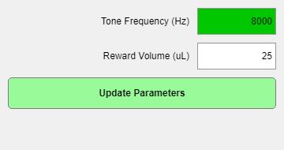

# `gui.Parameter_Update`



`gui.Parameter_Update` is a small controller class that owns an **"Update Parameters"** button and keeps it in sync with a set of parameter editor widgets.

The screenshot above shows the pending-edit state described in [Basic usage](#basic-usage): the `PulseWidth` control has an uncommitted change (`colorOnUpdate` highlight) and the **Update Parameters** button has enabled itself in response.

It solves a common GUI workflow:

- Let the user edit several parameters without immediately pushing changes to hardware.
- Visually indicate when there are pending (uncommitted) edits.
- Commit those edits either:
  - for upcoming trials (default), or
  - immediately (when a modifier key chord is held).
- Discard those edits and restore the previous values (when **Ctrl** alone is held).

## Where it fits

In EPsych, parameter editing is typically done with [`gui.Parameter_Control`](../../obj/+gui/Parameter_Control.m), which binds a single [`hw.Parameter`](../hw/hw_Parameter.md) to a UI control and exposes a boolean `ValueUpdated` flag when the UI differs from the underlying parameter value.

`gui.Parameter_Update` watches one or more `gui.Parameter_Control` objects and:

- Enables/disables the button based on whether any `ValueUpdated` flags are true.
- Updates button color/text to reflect the current state.
- Commits pending edits into:
  - `RUNTIME.TRIALS.trials` (so the new values apply to subsequent trials), and
  - optionally into `hw.Parameter.Value` (immediate mode, or software-only parameters).

## Basic usage

Typical pattern inside a GUI that already has a `RUNTIME` struct and a parent container (`uigridlayout`, `uipanel`, etc.):

```matlab
% Look up the hw.Parameter handles through the runtime
pPulseWidth = RUNTIME.find_parameter('PulseWidth');
pLevel      = RUNTIME.find_parameter('Level');

% Create parameter controls (one per hw.Parameter)
ctrl(1) = gui.Parameter_Control(parent, pPulseWidth, Type="editfield");
ctrl(2) = gui.Parameter_Control(parent, pLevel,      Type="editfield");

% Create the update button controller
updater = gui.Parameter_Update(RUNTIME, parent);

% Tell it which controls to watch
updater.watchedHandles = ctrl;
```

User experience:

- If the user changes any control, the button becomes enabled and shows **"Update Parameters"**.
- If nothing is pending, the button disables and shows **"Nothing to Update"**.
- Holding **Ctrl + Shift + Alt** while clicking changes behavior to **Immediate** (see below).
- Holding **Ctrl** alone relabels the button **"Reset Parameters"**; clicking discards the pending edits (see below).

## Immediate vs. next-trial updates

### Default: "Update Parameters for the Next Trial"

When clicked normally, `commit_changes` updates the trial table (`RUNTIME.TRIALS.trials`) for any parameters that are part of the protocol's write-parameters list.

This is done by looking up the parameter's protocol column via:

- `loc = RUNTIME.TRIALS.writeParamIdx`
- `P.validName` (from `hw.Parameter.validName`)

and assigning the updated value into the corresponding column.

Important nuance:

- For non-software interfaces, this mode typically does not write directly to `P.Value` (hardware) unless the parameter belongs to a software-only parent.

### "Update Parameters Immediately" (Ctrl + Shift + Alt)

When the modifier chord is held, `commit_changes` will additionally write the current UI value into the underlying `hw.Parameter`:

- `P.Value = watchedControl.Value`

This is intended for situations where you need the new setting applied right away (e.g., during an ongoing run), rather than waiting for the next trial boundary.

## "Reset Parameters" (Ctrl)

While the button is enabled and **Ctrl** alone is held, the button repaints to `color_resetChanges` and reads **"Reset Parameters"**. Releasing Ctrl restores the normal enabled state.

Clicking in that state calls `reset_changes`, which walks every watched control with a pending edit and calls its `reset_value()`. Each control's UI value is restored from the value its `hw.Parameter` currently holds, and the pending-edit highlight clears. Nothing is written to hardware and nothing is written to `RUNTIME.TRIALS.trials` — this only discards uncommitted UI state.

Modifier precedence: the Ctrl+Shift+Alt chord wins, so a partially-released chord that leaves only Ctrl held falls through to the reset state.

Reset is available from the moment an edit is pending until it is committed. Once committed, the pre-edit value is gone — there is no undo of a commit.

## What `watchedHandles` must provide

`watchedHandles` is expected to be an array of handle objects with at least:

- A set-observable logical property `ValueUpdated`
- A property `Value` containing the current UI value
- A property `Parameter` referencing an `hw.Parameter`
- A method `reset_label()` that clears the pending-edit indication
- A method `reset_value()` that restores the UI to the parameter's current value and clears the indication

`gui.Parameter_Control` satisfies this contract.

## Runtime/trials expectations

`commit_changes` expects `RUNTIME` to have (single-subject) trial state shaped like:

- `RUNTIME.TRIALS.trials`: a table-like cell array storing per-trial write-parameter values
- `RUNTIME.TRIALS.writeParamIdx`: struct mapping parameter valid-names to column indices

This mapping is created during runtime start-up (see [`ep_TimerFcn_Start`](../../runtime/timerfcns/ep_TimerFcn_Start.m)).

Current limitation: the implementation notes "CURRENTLY ONLY WORKS FOR SINGLE SUBJECT" and uses `RUNTIME.TRIALS` as a scalar struct. If your experiment runs multiple subjects simultaneously (where `RUNTIME.TRIALS(i)` is used), you'll need one updater per subject (or extend the class with a subject index).

## Keyboard handling note

The button repaints while modifiers are held, so it has to see them. Where it
reads them from depends on how it was constructed:

- **Inside a `gui.BehaviorGUI`** (`addUpdateButton`), a `KeySource` is passed
  in and the button listens to that [`gui.KeyBindings`](gui_KeyBindings.md)'s
  `ModifiersChanged` event. It touches no figure callback at all, so every
  other component's keys keep working whatever order `build` creates them in.
- **Standalone**, with no `KeySource`, it joins (or starts) the figure's
  shared `gui.KeyBindings` — `gui.KeyBindings.getOrCreate` — and listens the
  same way.

It used to claim `Figure.WindowKeyPressFcn`/`WindowKeyReleaseFcn` outright in
the standalone case, and that claim is why the centralization exists: a
figure has exactly one of each slot, and claiming it took the keys away from
every component built before it — which is what left the arrow keys in
`examples/two_afc/TwoAFCBehaviorGUI.m` advertised in the button tooltips and
dead in the window. In a behavior GUI, bind through `obj.Keys` and never
assign the figure callbacks yourself.

`commitPending()` is what a keyboard shortcut calls (`Ctrl+Enter` by default):
unlike `commit_changes` it returns immediately when nothing is pending,
matching the button's own disabled state.

## Related files

- [obj/+gui/Parameter_Update.m](../../obj/+gui/Parameter_Update.m): Implementation
- [obj/+gui/Parameter_Control.m](../../obj/+gui/Parameter_Control.m): Typical watched editor control
- [../hw/hw_Parameter.md](../hw/hw_Parameter.md): `hw.Parameter` overview
- [Parameter_Control.md](Parameter_Control.md): Editor control reference
- [runtime/timerfcns/ep_TimerFcn_Start.m](../../runtime/timerfcns/ep_TimerFcn_Start.m): Creates `TRIALS.writeParamIdx`

