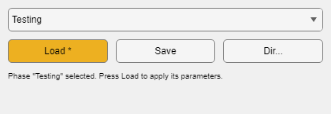

# gui.PhaseSelector



`gui.PhaseSelector` is a GUI component for switching between named **experiment phases** — saved parameter sets stored as protocol files. It lets an operator move a subject between training stages (for example, shaping → detection → psychometric testing) without editing the protocol or restarting the session.

The first half of this page explains the workflow for operators; the integration section at the end is for developers embedding the component in a task GUI.

Source class: [obj/+gui/@PhaseSelector/PhaseSelector.m](../../obj/+gui/@PhaseSelector/PhaseSelector.m)

## What a phase file is

Phases and protocols share one format: a phase file **is** a protocol file (`.eprot`; see [../epsych/epsych_Protocol.md](../epsych/epsych_Protocol.md)). Saving a phase serializes the session's protocol with the current parameter values (`epsych.Runtime.writeParametersProtocol`); loading a phase reads a protocol file and applies its parameters to the live session (`epsych.Runtime.readParameters`). Files live together in a phase directory (for example `cl/@cl_AppetitiveDetection_GUI_B/Phases/`), and each file's name (without extension) becomes the phase name shown in the dropdown.

Because a phase is a full protocol, it can be opened, inspected, and edited in `epsych.ProtocolDesigner`, and it carries everything the protocol format does — parameter values, design-time `Values` lists, parameter Expressions, and trial options — not just a flat value snapshot.

Legacy JSON snapshots (written by `epsych.Runtime.writeParametersJSON` in earlier versions) are still discovered and loaded; new saves always produce `.eprot` files.

## Using the phase selector (operators)

The component appears in task GUIs (such as the appetitive detection GUI) as a description label, a dropdown, and a row of three buttons, shown in the screenshot above:

- **Description label** — reports the current selection state (or the searched directory when no phases were found) above the dropdown, plus the most recently loaded phase and load time once a load has occurred.
- **Dropdown** — pick a phase by name. Selecting a phase does not change anything, but prints a table of parameters with their current values and the values the phase would apply to the command window, so you can sanity-check the change before loading it.
- **Load** — apply the selected phase: parameter values from the file are written to the live parameters and synchronized into the trial table, and a protocol recompile is scheduled for the next trial boundary so the phase's trial structure (value lists, expressions) takes effect, not just its current values. The session-control buttons (**Deliver Trials**, **Reminder**, **Shape**, **Observe**, **Pellet**, **Trough**) are **not** touched by a load — see below.
- **Save** — snapshot the current session as a new phase protocol (`.eprot`; you are prompted for a name).
- **Dir...** — pick a different phase directory (`uigetdir`); the dropdown rescans and repopulates from the newly chosen directory.

Typical workflow:

1. During setup, get each training stage's parameters right once, then **Save** a phase file per stage.
2. During later sessions, pick the subject's stage from the dropdown, check the printed parameter changes in the command window, then **Load**.

### What a load does not change

Loading a phase never moves the session-control buttons. A phase file is a full protocol snapshot, so it records whatever state those buttons happened to be in when it was saved — and without this rule, loading a phase saved mid-session with **Deliver Trials** active would start delivering trials the moment you pressed **Load**. The excluded parameters are triggers and the operator's live toggles; the printed preview table and the load dialog both omit them, so what they list is what actually changes.

Everything else still loads normally, including genuine on/off settings such as **Repeat Delay on Abort** — the distinction is made by `hw.Parameter.isTransientControl` (writable Booleans the trial dispatcher never refreshes), not by a hardcoded list of names. If you want a toggle's state to travel with the phase, set it as a parameter the dispatcher refreshes (`UpdateEveryTrial = true`) in the protocol.

Loads are logged on the runtime (`RUNTIME.Phase`) with a timestamp and source path, so the session record shows which phase was active.

## Integration (developers)

```matlab
ps = gui.PhaseSelector(RUNTIME, phaseDir);  % phaseDir contains *.eprot phase files (legacy *.json also found)
h  = ps.createGUI(parentContainer);          % description label + dropdown + Load/Save/Dir... buttons
```

`createGUI` lays the controls out in a 3-row grid: the description label on row 1, the dropdown on row 2, and Load/Save/Dir... in a row of three buttons on row 3. Individual controls can also be placed separately (`addPhaseSelectDropdown`, `addLoadPhaseButton`, `addSavePhaseButton`, `addChangeDirectoryButton`, `addDescriptionLabel`) when the host GUI needs a custom layout.

Create the component unconditionally — **do not** gate it on `isfolder(phaseDir)`. A missing, unset, or empty phase directory is a normal state: `findPhaseFiles` logs where it looked and leaves the phase list empty, the dropdown shows only its `< Select Phase >` entry with **Load** disabled, and the description names the directory it searched. **Save** stays available, which is how the first phase file gets created; if the configured directory does not exist, saving adopts the directory the file was written to so the new phase appears in the dropdown immediately. Hiding the control until phases exist leaves the operator no way to create one.

Key behavior:

- `PhasePath` is observable; assigning a new directory rescans for `*.eprot`, `*.prot`, and legacy `*.json` files and repopulates the dropdown. `changePhaseDirectory` (bound to **Dir...**) is the operator-facing entry point: it prompts with `uigetdir` and assigns the result to `PhasePath`.
- `onPhaseSelectionChanged` calls `showPhaseInfo` automatically whenever the dropdown selection changes to a real phase, printing the current-vs-phase comparison table (built by `computePhaseChanges`) to the command window.
- `loadPhaseParameters` delegates to `RUNTIME.readParameters`, which parses the file (`epsych.Runtime.phaseParameterData`), resolves each named parameter against the live interfaces, assigns its value, and schedules a safe-boundary protocol recompile (`TRIALS.RECOMPILE_REQUESTED`, applied by `ep_TimerFcn_RunTime`); `RUNTIME.updateTrialsFromParameters` then pushes writable values into the trial table for trials dispatched before that boundary.
- Parameters satisfying `hw.Parameter.isTransientControl` — triggers, and writable Booleans with `UpdateEveryTrial == false` (the operator's toggles and momentary buttons) — have their metadata and design-time `Values` restored but keep their live value. `resolvePhaseAgainstRuntime` skips them so `computePhaseChanges` never previews a change that will not happen, and `loadPhaseParameters` drops them from the set handed to `updateTrialsFromParameters`.
- `writePhaseParameters` delegates to `RUNTIME.writeParametersProtocol`, which serializes the session's `epsych.Protocol` (`RUNTIME.Protocol`) and then reconciles the snapshot with the session's effective values: deferred trial-table commits (`gui.Parameter_Update` without the immediate modifier) that have not yet dispatched are captured, and each single-level parameter's design-time `Values` list is refreshed to the effective value so the phase's recompile-on-load reproduces the runtime edits instead of reverting them. Roved, expression-driven, randomized, trigger, and per-trial-managed (e.g. staircase) parameters keep their design state.

Keep the handle returned by the constructor on your GUI object so the component is not garbage-collected, and follow the cleanup guidance in [../design/Customized_GUI_Instructions.md](../design/Customized_GUI_Instructions.md).

## Related documentation

- [../epsych/epsych_Runtime.md](../epsych/epsych_Runtime.md) — `writeParametersProtocol` / `readParameters` reference
- [../design/Customized_GUI_Instructions.md](../design/Customized_GUI_Instructions.md) — building task GUIs that host this component
- [Parameter_Update.md](Parameter_Update.md) — committing individual parameter edits (complementary to phase loads)
