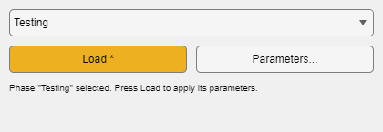

# gui.components.PhaseSelector



`gui.components.PhaseSelector` is a GUI component for switching between named **experiment phases** — saved parameter sets stored as protocol files. It lets an operator move a subject between training stages (for example, shaping → detection → psychometric testing) without editing the protocol or restarting the session.

The first half of this page explains the workflow for operators; the integration section at the end is for developers embedding the component in a task GUI.

Source class: [obj/+gui/+components/@PhaseSelector/PhaseSelector.m](../../obj/+gui/+components/@PhaseSelector/PhaseSelector.m)

## What a phase file is

Phases and protocols share one format: a phase file **is** a protocol file (`.eprot`; see [../epsych/epsych_Protocol.md](../epsych/epsych_Protocol.md)). Saving a phase serializes the session's protocol with the current parameter values (`epsych.Runtime.writeParametersProtocol`); loading a phase reads a protocol file and applies its parameters to the live session (`epsych.Runtime.readParameters`). Files live together in a phase directory (for example `paradigms/@cl_AppetitiveDetection_GUI_B/Phases/`), and each file's name (without extension) becomes the phase name shown in the dropdown, followed by the protocol version stored in the file — `Phase_5_Psychometric_Testing (v103.260820)`.

That version is the version of the **protocol the phase was captured from**, not a version of the phase file: `epsych.Runtime.writeParametersProtocol` deliberately never mints one, so a phase's version moves only when it is recaptured from a re-saved protocol. Showing it side by side is what makes a stale phase visible — a directory reading `v103, v103, v101, v103` says at a glance which stage was last captured from an older protocol. A phase saved before versions were stamped, a legacy `.json` snapshot, and an unreadable file all read as no version and are listed undecorated; an absent version is not "version 0", and every file found is still named.

Because a phase is a full protocol, it can be opened, inspected, and edited in `epsych.ProtocolDesigner`, and it carries everything the protocol format does — parameter values, design-time `Values` lists, parameter Expressions, and trial options — not just a flat value snapshot.

Legacy JSON snapshots (written by `epsych.Runtime.writeParametersJSON` in earlier versions) are still discovered and loaded; new saves always produce `.eprot` files.

## Using the phase selector (operators)

The component appears in task GUIs (such as the appetitive detection GUI) as a dropdown, two buttons, and a description label, shown in the screenshot above. Everything else is on a **right-click menu** that every part of the component shares (see [The right-click menu](#the-right-click-menu)).

- **Description label** — reports the current selection state (or the searched directory when no phases were found) above the dropdown, plus the most recently loaded phase and load time once a load has occurred.
- **Dropdown** — pick a phase by name. Selecting a phase does not change anything, but prints a table of parameters with their current values and the values the phase would apply to the command window, so you can sanity-check the change before loading it.
- **Load** — apply the selected phase: parameter values from the file are written to the live parameters and synchronized into the trial table, and a protocol recompile is scheduled for the next trial boundary so the phase's trial structure (value lists, expressions) takes effect, not just its current values. **During a run (Record or Preview), a load that changed any parameter then regenerates the pending trial**, exactly as the [Regenerate Trial](gui_RegenerateTrial.md) button does: the trial the rig is holding was dispatched with the previous phase's values, so it is dispatched again with the new ones instead of waiting for the next trial. Like the button, **this interrupts a trial in progress** without asking, and the trial counter does not move; the session notes record it (`Regenerated trial 12 (row 3): phase "..." loaded`). A load that changed nothing, or one made while the session is idle or stopped, does not regenerate. The session-control buttons (**Deliver Trials**, **Reminder**, **Shape**, **Observe**, **Pellet**, **Trough**) are **not** touched by a load — see below. While a phase is selected but not yet applied, the button reads **"Load \*"** in an amber color to flag that the selection is only staged; pressing it (or returning the dropdown to `< Select Phase >`) restores the default "Load" look. If you chose parameters with **Parameters...**, Load applies only those (next item).
- **Parameters...** — choose which of the selected phase's parameters **Load** will apply, and optionally load a different value than the phase holds for some of them. Nothing is loaded when you close the chooser; your answer is **kept** until you press **Load**, and the button reads **"Parameters... \*"** in bold while it is (its tooltip and the description label summarize it: `Load will apply 10 of 12 parameter(s), 2 edited value(s)`). See [Loading only some parameters](#loading-only-some-parameters).

Typical workflow:

1. During setup, get each training stage's parameters right once, then right-click and **Save Current Parameters as Phase...** for each stage.
2. During later sessions, pick the subject's stage from the dropdown, check the printed parameter changes in the command window, then **Load**.

### The right-click menu

Right-click anywhere on the component — the dropdown, either button, the description, or the space between them:

| Item | What it does |
|---|---|
| **Load Selected Phase** | The same as the **Load** button. |
| **Select Parameters to Load...** | The same as the **Parameters...** button. |
| **Clear Parameter Selection** | Forget the Parameters... answer, so Load applies the whole phase again. |
| **Always Choose Before Loading** | Make every press of **Load** open the chooser first (then load). The button reads **"Load..."**, and the choice is remembered on this computer. |
| **Print Phase Changes to Command Window** | Print the current-vs-phase table again (selecting a phase prints it too). |
| **Save Current Parameters as Phase...** | Snapshot the current session as a new phase protocol (`.eprot`; you are prompted for a name). Formerly the **Save** button. |
| **Change Phase Directory...** | Pick a different phase directory (`uigetdir`); the dropdown rescans from it. Formerly the **Dir...** button. |
| **Rescan Phase Directory** | Pick up phase files saved or copied into the directory since it was scanned, keeping the selected phase. |

Load and the two parameter items are greyed until a phase is selected; Clear is greyed while no selection is kept.

### Loading only some parameters

By default **Load** applies every parameter the phase defines. To keep some of the current session's settings — a delay you have tuned for this animal, say — or to load one value differently this time, press **Parameters...** (or turn on **Always Choose Before Loading**, which opens the same table from Load).

The chooser is a table with one row per parameter the phase would load, every box **checked** to start:

| Column | What it shows |
|---|---|
| **Load** | Checked: load it from the phase. Unchecked: leave it exactly as it is now. |
| **Parameter** | Which parameter (with its module, when two interfaces have one of the same name). |
| **Current** / **New** | Its value now, and the value the phase would give it. **New** is bold where the value itself changes. **New is editable** where the cell is shaded — see below. |
| **Unit** | The parameter's unit. |
| **Other Changes** | Anything else the phase would change about it: its range (`range [0, 500] → [0, 1000]`), its roved levels, its expression, randomization, type, or visibility. A stimulus or a write-only parameter cannot be compared and is always re-applied, which is said here rather than guessed. |

Only the parameters the phase would **change** are listed at first; tick **Show unchanged** to list the rest (greyed). Loading a parameter the phase does not change does nothing either way, so hiding them is safe, and **Check All** / **Check None** act on the rows you can see. **OK** keeps the answer for the next Load (from **Parameters...**) or loads at once (the button reads **Load** when the chooser was opened by Load itself); **Cancel** (or Esc) changes nothing. Reopening **Parameters...** shows the answer you kept. The session-control buttons are never listed — a load does not move them anyway (next section).

An unchecked parameter is left **completely** alone: its value, its range, its levels, its expression. That includes the protocol recompile a load schedules for the next trial boundary, which would ordinarily rebuild every trial-table column from the protocol's design values — the unchecked parameter's design value is first brought up to what it is running now, so the recompile keeps it (see [../epsych/epsych_Runtime.md](../epsych/epsych_Runtime.md), "Loading part of a phase"). The session notes record what was kept (`Loaded phase "Phase_4C"; updated: Depth, RespWinDur; kept as they were: StimDelay`), and the description label says how many were kept.

**Editing a value.** Type into a shaded **New** cell to load that value instead of the phase's. The edited cell turns blue and italic, and the row is checked for you. The value is used **for this load only**: the phase file is not changed, and the next time you load that phase you get the file's value again. Clear the cell (or type the phase's own value) to go back to it. What you type is checked as you enter it — one number within the phase's range (a whole number for an integer parameter), `true`/`false` for an on/off setting, or text — and a value that does not fit is put back with the reason in red at the bottom. A cell is **not** editable, and says why if you try, when its value could not be one fixed number you chose: it is computed by an expression, randomized every trial, roved over several levels, a stimulus or buffer, or read-only. The edited value also replaces the parameter's design value, so the recompile keeps it rather than reverting to the file's. The session notes record it beside the file's value (`...; values edited for this load: StimDelay = 300 (phase: 250)`), and so does `RUNTIME.Phase(end).Overrides`.

A kept selection belongs to **one phase**. Choosing another phase in the dropdown discards it, and so does a load (it has been used). If the phase file is saved again after you made the selection, **Load refuses** with a warning rather than guess — what you unchecked may no longer describe the file — and you choose again.

### What a load does not change

Loading a phase never moves the session-control buttons. A phase file is a full protocol snapshot, so it records whatever state those buttons happened to be in when it was saved — and without this rule, loading a phase saved mid-session with **Deliver Trials** active would start delivering trials the moment you pressed **Load**. The excluded parameters are triggers and the operator's live toggles; the printed preview table and the load dialog both omit them, so what they list is what actually changes.

Everything else still loads normally, including genuine on/off settings such as **Repeat Delay on Abort** and **Present Catch Trials** — the distinction is made by `hw.Parameter.isTransientControl` (writable Booleans the trial dispatcher never refreshes — `UpdateEveryTrial` and `SetOnce` both off), not by a hardcoded list of names. If you want a toggle's state to travel with the phase, either make it a parameter the dispatcher refreshes (`UpdateEveryTrial = true`) in the protocol, or set `PersistWithPhase = true` on it — the second is for a toggle the dispatcher must *not* own, such as one a trial selector reads and writes outside the trial table.

Loads are logged on the runtime (`RUNTIME.Phase`) with a timestamp and source path, so the session record shows which phase was active.

## Integration (developers)

```matlab
ps = gui.components.PhaseSelector(RUNTIME, phaseDir);  % phaseDir contains *.eprot phase files (legacy *.json also found)
h  = ps.createGUI(parentContainer);          % dropdown + Load/Parameters... + description + shared right-click menu
```

`createGUI` lays the controls out in a 3-row grid: the dropdown on row 1, **Load** and **Parameters...** side by side on row 2, and the description label on row 3; `h.ContextMenu` is the shared menu. Individual controls can also be placed separately (`addPhaseSelectDropdown`, `addLoadPhaseButton`, `addSelectParametersButton`, `addSavePhaseButton`, `addChangeDirectoryButton`, `addDescriptionLabel`) when the host GUI needs a custom layout; `createGUI` no longer uses the Save and Dir... button builders, which stay for a host that wants them as buttons. Every `add*` method attaches the same menu (built on first use, rebuilt only if a control lands in a different figure), so its Enable and check states have one place to be kept right.

Create the component unconditionally — **do not** gate it on `isfolder(phaseDir)`. A missing, unset, or empty phase directory is a normal state: `findPhaseFiles` logs where it looked and leaves the phase list empty, the dropdown shows only its `< Select Phase >` entry with **Load** disabled, and the description names the directory it searched. **Save** (on the right-click menu) stays available, which is how the first phase file gets created; if the configured directory does not exist, saving adopts the directory the file was written to so the new phase appears in the dropdown immediately. Hiding the control until phases exist leaves the operator no way to create one.

Key behavior:

- The dropdown's **label and its value are deliberately different things**: `Items` carries the version-decorated `DisplayNames`, `ItemsData` the undecorated `Names`. So `h_PhaseSelect.Value` is always the bare phase name, and everything that resolves a selection — `selectedPhaseFile`, which finds the `Value` in `Names`, and any caller that sets `Value` by name — is untouched by how the list is labelled. The two arrays must be assigned in a single `set(...)` call (as `refreshPhaseDropdown` does): leaving them at different lengths, as two dot assignments briefly would, makes the dropdown throw. `versionLabels_` builds the labels through `epsych.Protocol.versionOnDisk`, which reads the one metadata variable rather than rebuilding the protocol object graph and never throws, so scanning a directory of phases costs one small MAT read each. Standing proof: `tmp/smoke_test_phaseselector_version_label.m`.
- `PhasePath` is observable; assigning a new directory rescans for `*.eprot` and legacy `*.json` files and repopulates the dropdown. `changePhaseDirectory` (the menu's **Change Phase Directory...**) is the operator-facing entry point: it prompts with `uigetdir` and assigns the result to `PhasePath`. `rescanPhaseDirectory` rescans without resetting the dropdown when the selected phase is still there, so a kept parameter selection survives it.
- `onPhaseSelectionChanged` calls `showPhaseInfo` automatically whenever the dropdown selection changes to a real phase, printing the current-vs-phase comparison table (built by `computePhaseChanges`) to the command window. It also toggles the Load button's staged look (`markLoadButtonStaged` / `resetLoadButtonAppearance`); `loadPhaseParameters` calls `resetLoadButtonAppearance` again once the load completes, so the staged look never survives past the load it describes. The default color is captured once, from the button itself, when `addLoadPhaseButton` creates it.
- **Choosing parameters.** `loadPhaseParameters(src, SelectParameters=true)` opens `gui.selectPhaseParameters` before anything is written, and `loadPhaseParameters(src, Exclude=names)` leaves the named parameters (names, on every interface that has one, or `hw.Parameter` handles) untouched with no dialog; together, the excluded ones start unchecked. Both end in `RUNTIME.readParameters(file, Exclude=...)`. `SelectParametersOnLoad` (default `false`) is what the **Load button** passes — the method's own default is `false`, so a scripted call can never block on a modal dialog, however the rig's operator has set the button. The property is `Dependent` over a private field so its setter can repaint the button (`"Load..."`) and the menu's check mark; the right-click toggle is the only thing that writes the `epsych2_gui_PhaseSelector/SelectParametersOnLoad` preference, so a paradigm that sets the property from code is not remembered, and the constructor restores the operator's choice before `build` can override it. The chooser's rows come from the same `resolvePhaseAgainstRuntime` the preview uses (which now carries each file `Entry` for the "Other Changes" comparison), so they list exactly what a load would touch; its snapshot is **not** reused for the load's `before` snapshot, because the operator can spend a while in the dialog while trials run. Cancelling returns before `CurrentPhase`, the progress dialog, or any note. `gui.selectPhaseParameters` is built hidden and shown complete, and blocks in `waitfor` rather than `uiwait` — building a uifigure yields, and a window answered in that instant would make `uiwait` throw on the deleted handle. Standing proof: `tmp/smoke_test_phaseselector_select_parameters.m` (drives the dialog from a timer; run it under `matlab -batch`).
- **Kept selections and edited values.** `chooseParameters` (the **Parameters...** button) runs the same chooser but stores the answer in a private `Selection_` — `File`, the file's modification date, `Exclude` (handles), `Override` (struct array `Parameter`/`Value`), `NumListed` — exposed read-only as `ParameterSelection`. The Load button passes `UseSelection=true`; the method's default is false, so a script is never steered by an operator's pending choice. The stated `Exclude`/`Override` are appended **after** the kept ones, and `readParameters` takes the last override naming a parameter, so what a caller states wins. A selection is tied to its file path (a dropdown change to another file discards it; `rescanPhaseDirectory` keeps it) and to that file's modification date: a mismatch at Load **refuses** the load, discards the selection, and raises a `uialert`, because loading everything would silently undo what the operator unchecked. Any successful load clears it. Edited values reach the runtime as `readParameters(file, Override=...)`, which writes the value into its **own copy** of the parsed entry — `Value`, and `Values = {value}` because the scheduled recompile rebuilds from `Values` — before `fromStruct`, so neither the file nor `phaseCache` changes and the rest of the entry (range, visibility) loads as usual. Which cells are editable is one shared rule, `epsych.Runtime.phaseValueOverridable(entry, liveParameter)`, used by the chooser to shade cells and by `readParameters` to refuse an override (logged; the file's value loads): an expression — the file's, or the live one `readParameters` keeps when the file's is empty, since `set.Value` would recompute over the override — randomization, more than one level, a non-value type, read-only, or session control. What is typed is parsed by `epsych.ParameterDefaults.parseValue` (no `eval`) and must be one value within the entry's `Min`/`Max`, whole for `Integer` — the range check is there because `set.Value` would otherwise clamp and load something the operator did not type. The session note names each edit with the phase's value beside it, built from values already in hand (the override and the pre-load snapshot), never from a device read. `loadPhaseParameters(src, Override={'StimDelay', 300})` does the same from a script (cell of name/value pairs, or a `Parameter`/`Value` struct array whose `Parameter` is a name or a handle).
- `loadPhaseParameters` delegates to `RUNTIME.readParameters`, which parses the file (`epsych.Runtime.phaseParameterData`), resolves each named parameter against the live interfaces, assigns its value, and schedules a safe-boundary protocol recompile (`TRIALS.RECOMPILE_REQUESTED`, applied by `ep_TimerFcn_RunTime`); `RUNTIME.updateTrialsFromParameters` then pushes writable values into the trial table for trials dispatched before that boundary.
- After a load that changed something, `regenerateAfterLoad_` re-dispatches each affected box's pending trial through `gui.components.RegenerateTrial.redispatch` — the button's own dispatch, log, and note, without its arming. It runs only while the run mode is Record or Preview, which the component **follows** from `ModeChange` (a listener made in the constructor) rather than reads: a behavior GUI is built before `RunExpt` broadcasts the mode, and asking the interfaces would be a device round trip. A runtime with no `EventHub` therefore never regenerates. Boxes on a different protocol object are skipped, matching the recompile `readParameters` schedules. `RegenerateOnLoad = false` turns it off. Standing proof: `tmp/smoke_test_phaseselector_regenerate.m`.
- Parameters satisfying `hw.Parameter.isTransientControl` — triggers, and writable Booleans with `UpdateEveryTrial == false`, `SetOnce == false`, and `PersistWithPhase == false` (the operator's toggles and momentary buttons) — have their metadata and design-time `Values` restored but keep their live value. `resolvePhaseAgainstRuntime` skips them so `computePhaseChanges` never previews a change that will not happen, and `loadPhaseParameters` drops them from the set handed to `updateTrialsFromParameters`. `PersistWithPhase` is read from the **live** parameter rather than the file (it is code-owned; see `documentation/hw/hw_Parameter.md`), which is why that test runs after the file entry has been resolved to its `hw.Parameter` rather than before.
- A preview-plus-**Load** reads the phase file **once**. `loadPhaseParameters` parses it up front and hands the entries to `resolvePhaseAgainstRuntime` for the pre-load snapshot; `readParameters` then gets the same parse back from `epsych.Runtime.phaseCache`, as did the dropdown preview seconds earlier. (Each of those three used to parse the file for itself, which on a real protocol cost seconds inside a running session.) The snapshot itself is deliberately *not* carried over from the preview: live values can change while the operator decides, and a stale snapshot would credit the phase with someone else's edit. Browsing the dropdown is likewise free after the first look at each phase.
- `writePhaseParameters` delegates to `RUNTIME.writeParametersProtocol`, which serializes the session's `epsych.Protocol` (`RUNTIME.Protocol`) and then reconciles the snapshot with the session's effective values: deferred trial-table commits (`gui.components.Parameter_Update` without the immediate modifier) that have not yet dispatched are captured, and each single-level parameter's design-time `Values` list is refreshed to the effective value so the phase's recompile-on-load reproduces the runtime edits instead of reverting them. Roved, expression-driven, randomized, trigger, and per-trial-managed (e.g. staircase) parameters keep their design state.

Keep the handle returned by the constructor on your GUI object so the component is not garbage-collected, and follow the cleanup guidance in [../design/Customized_GUI_Instructions.md](../design/Customized_GUI_Instructions.md).

## Related documentation

- [../epsych/epsych_Runtime.md](../epsych/epsych_Runtime.md) — `writeParametersProtocol` / `readParameters` reference
- [../design/Customized_GUI_Instructions.md](../design/Customized_GUI_Instructions.md) — building task GUIs that host this component
- [Parameter_Update.md](Parameter_Update.md) — committing individual parameter edits (complementary to phase loads)
