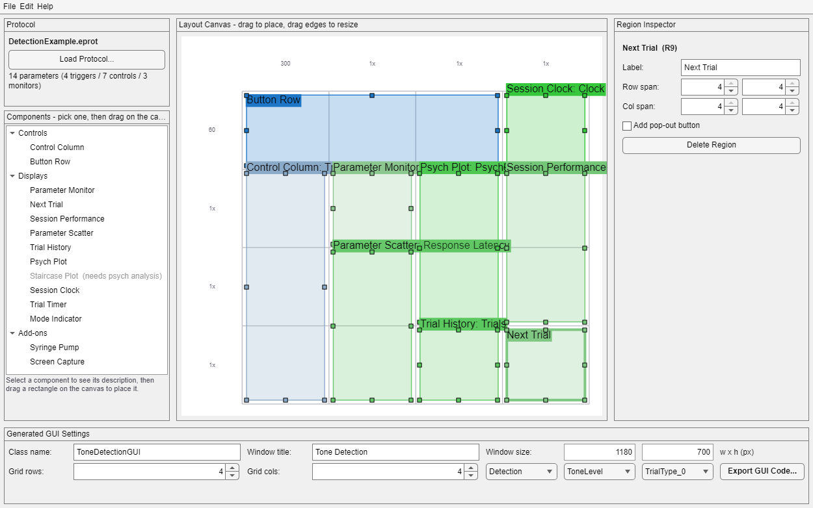

# gui.BehaviorBuilder — Behavior GUI Builder

`gui.BehaviorBuilder` is a design-time window that lets someone with no
MATLAB GUI experience produce a working experiment GUI: load a protocol,
pick components from a palette, drag rectangles on a snap-to-grid canvas,
and export a readable `gui.BehaviorGUI` subclass. The design itself lives
in an **`.eblt` layout-spec file** (JSON) that the builder re-opens for
later changes, so the layout is never trapped inside generated code.

```matlab
gui.BehaviorBuilder              % empty builder
gui.BehaviorBuilder('MyTask.eblt')  % re-open an existing design
```



*Mid-design over `examples/detection_task/DetectionExample.eprot`: the
protocol panel's parameter census on the left over the palette (Staircase
Plot greyed because the chosen analysis is Detection), nine regions on the
4x4 canvas, the just-placed Next Trial region selected so the inspector is
populated, and the generated-GUI identity along the bottom.*

Help > Builder Guide (Wiki) opens the operator-facing walkthrough at
`gui.BehaviorBuilder.WIKI_URL`
(https://github.com/dstolz/epsych2/wiki/Behavior-GUI-Builder); Help >
Reference Documentation opens this file, for a rig with no network.

## Workflow

1. **Load a protocol** (`.eprot`; File > Load Protocol...). The builder
   flattens every interface's parameters into a snapshot and shows the
   trigger/control/monitor counts (classified by
   `gui.BehaviorGUI.classifyParameters`).
2. **Pick a component** in the palette, then **drag a rectangle** on the
   canvas to place it (a bare click takes one cell). The component's
   options dialog opens immediately; cancelling removes the region, so
   nothing is ever half-configured.
3. **Arrange**: drag regions to move, drag their handles to resize —
   everything snaps to whole grid cells and overlaps are refused (the drag
   reverts). The selected region's label, spans, pop-out button, and
   options are edited in the inspector on the right. Click a row/column
   header to change that row's height or column's width (`60` pixels or a
   weight like `1x`).
4. **Settings bar** (bottom): class name, window title, default size, grid
   dimensions, and the **psych analysis** (None / Staircase / Detection
   plus its parameter). History, Psych Plot, and Staircase Plot are greyed
   out until an analysis is chosen; switching back to None is refused
   while such regions exist.
5. **Export GUI Code...** saves the `.eblt` first (code and spec never
   diverge), then writes `<ClassName>.m`. A file-name/class-name mismatch
   offers the rename, overwriting a non-generated file warns loudly, and a
   target folder that is not on the MATLAB path gets an `addpath` hint.
   Point a project at the class via Subjects > Subjects & Projects,
   Project > Edit Project..., Behavior GUI.

## The component palette

| Category | Components |
|---|---|
| Controls | Control Column (parameter controls in a titled `controlColumn`, Update button added automatically), Button Row (trigger/toggle buttons, optional Screen Capture) |
| Displays | Parameter Monitor, Next Trial, Session Performance, Parameter Scatter, Trial History*, Psych Plot*, Staircase Plot*, Sliding Window*, Online Plot (names the parameters or bitmask bank to trace), Buffer Plot (buffer contents, once per trial), Session Clock, Trial Timer, Mode Indicator |
| Add-ons | Session Notes (stamp format, starting Editable state, and whether the region is the whole pad or just a button opening it), Syringe Pump (only `Sections` is configurable — everything else follows the rig's saved pump preferences), Screen Capture, Session Gate (button label), Phase Selector (phase folder), Status Bar (initial text), Filename Field (default `.mat` name) |

\* requires a psych analysis. Pop-out buttons can be added to any
`gui.PopOut` adopter via the inspector checkbox.

**Session Gate** places only the button. The hold itself is
`obj.waitForSessionGate()` in a constructor, which the builder does not
generate — the emitted code carries a comment saying so. See
[gui_SessionGate.md](gui_SessionGate.md).

**Online Plot** must name at least one source: left empty, `gui.OnlinePlot`
opens a `listdlg` at construction, which a generated `build` must never do.
Validation refuses a sourceless region rather than generating one. The
dialog lists the protocol's Read parameters and takes bitmask **bank** names
as free text, because a bank's `~BMid-*` parameters are invisible and so
never reach the layout spec's parameter snapshot.

**Buffer Plot** is the opposite case: leaving its buffer list empty is a real
answer, since `gui.BufferPlot` then takes the session's own `Buffer`
parameters, so there is nothing for validation to insist on. Its dialog also
sets the sample rate (0 keeps the x axis in buffer samples), the layout, and
how many past trials are drawn — see [gui_BufferPlot.md](gui_BufferPlot.md).

Session Notes in its **Button only** form is its own pop-out opener, so
validation clears the region's pop-out flag rather than generating a second
button onto the same window — see [gui_Notes.md](gui_Notes.md).

Control types default through the same scoring `gui.Parameter_Control`
uses for `Type='auto'` (trigger → momentary, read-only or expression →
readonly, Boolean → checkbox, multiple Values → dropdown, else editfield);
the dialog exposes `auto`/`editfield`/`dropdown`/`checkbox`/`readonly`,
and anything fancier (`range`, `stimtype`, PostUpdateFcn chains) is a
hand edit in the generated file.

## What the generated code looks like

The emitted class mirrors `examples/customgui/ExampleBehaviorGUI.m`: a
constructor that forwards `Name=`/`DefaultPosition=`, an optional guarded
`createPsych`, and a `build(obj, fig)` of `uigridlayout` +
`obj.add*` helper calls (plus registered native constructions where no
helper exists). It never emits destructors, listeners, or `closeGUI` —
the base class owns lifecycle — and every parameter-dependent construction
is guarded, so the GUI survives `epsych.SelfTest` check I6's
empty-runtime launch. A `LayoutSpecFile` constant records the `.eblt`
path; the header comment says the same for humans.

Generated GUIs whose component class appears more than once get explicit
`PreferenceTag`s (`<ClassName>_<RegionId>`), so two monitors in one window
don't share saved preferences.

## The .eblt layout spec

Pretty-printed JSON, `FormatVersion` 1: identity (`ClassName`,
`WindowName`, `DefaultSize`), `ProtocolPath` plus a `ParameterSnapshot`
(name, access, type, trigger/values/expression flags — never serialized
`hw.Parameter` objects), the `Grid` (rows/cols and per-row/column size
strings), `Psych`, and one `Regions` entry per placed component
(`Id`/`Type`/`Label`/`Row`/`Col`/`PopOut`/`Options`). NaN is forbidden
everywhere so `jsonencode` round trips exactly.

If the spec's protocol file is missing at open (moved share, renamed
file), the builder opens in **degraded mode**: regions render and pickers
work off the snapshot, with a banner offering Load Protocol... to
relocate it.

Headless use — the whole model works without the window:

```matlab
spec = gui.BehaviorBuilder.specNew;
% ... fill spec.Regions programmatically ...
gui.BehaviorBuilder.saveSpecFile(spec, 'MyTask.eblt');
gui.BehaviorBuilder.writeCode(spec, 'MyTask.eblt');   % -> MyTaskGUI.m
```

## Validation

`tmp/smoke_test_behaviorbuilder.m` is the standing check: exact spec
round trip, the validation tripwires (overlap, psych gating, bad names),
lint-clean generated code with the right class shape, generated GUIs
constructed against a software runtime and the empty runtime, and the
builder window drawing one snapped ROI per region.

```matlab
matlab -batch "run('tmp/smoke_test_behaviorbuilder.m')"
```

## See also

- `documentation/gui/gui_BehaviorGUI.md` — the subclass contract the
  generated code targets
- `examples/customgui/` — the hand-written template and its
  hardware-free `run_example.m` harness
- `documentation/design/Customized_GUI_Instructions.md` — growing a
  generated GUI by hand
- [Behavior GUI Builder](https://github.com/dstolz/epsych2/wiki/Behavior-GUI-Builder)
  — the wiki guide the Help menu opens: the same workflow written for an
  operator, with the shot of the exported GUI beside the canvas
