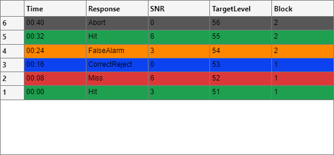

# gui.History

## Overview



`gui.History` renders a trial-by-trial summary table for behavioral sessions.

The screenshot above shows the default display: newest trial first (row 6 at top), the `Time`/`Response` columns from [Display Format](#display-format), and rows colored per [Color Resolution](#color-resolution) (green Hit, red Miss, blue CorrectReject, orange FalseAlarm, gray Abort).
It listens for new data events from a linked psychophysics object and updates
an on-screen table with relative time, decoded response labels, and selected
trial parameters.

Source file: [obj/+gui/@History/History.m](../../obj/+gui/@History/History.m)

## What This Class Does

- Creates a `uitable` in a provided figure or panel container.
- Subscribes to `NewData` events and refreshes table contents automatically.
- Shows the newest trial at the top by default (chronological `DATA` order,
  not `TrialID`, which is a schedule/condition identifier).
- Supports user sorting via column header clicks (uifigure containers); the
  selected sort is reapplied on every trial update instead of being reset.
- Supports user column rearranging by dragging a column header (uifigure
  containers); the chosen order is reapplied on every trial update instead
  of being reset.
- Provides a right-click context menu to show/hide parameter columns and to
  reset sorting or column order to their defaults.
- Persists column selection, column order, and sort order across MATLAB
  sessions with `getpref`/`setpref`, keyed to the hosting GUI figure.
- Colors rows by decoded response bit for quick visual review.
- Supports optional color overrides via `BitColors`.

## Constructor

```matlab
H = gui.History(pObj, container)
H = gui.History(pObj, container, BitColors=colors)
H = gui.History(pObj, container, ColumnFormats=formats)
H = gui.History(pObj, container, PreferenceTag=tag)
```

### Inputs

- `pObj`
  - Psychophysics object with `DATA`, `responseCodes`, `BitColors`, and `Events`.
- `container`
  - Figure or panel that hosts the table. If empty, a new figure is created.
- `BitColors`
  - Optional hex color list used instead of `pObj.BitColors`.
- `ColumnFormats`
  - Optional `sprintf` format string(s) applied to all displayed columns.
  - Provide either one format for every column or one format per displayed column.
- `PreferenceTag`
  - Optional key for saved preferences. Defaults to the hosting figure `Tag`
    (or `Name`), so each GUI keeps its own column and sorting preferences.

### Returns

- `H`
  - A `gui.History` instance.

## Display Format

The table shows these columns in order:

1. `Trial` (chronological trial number)
2. `Time` (relative to first trial timestamp, formatted `mm:ss`)
3. `Response` (decoded response bit text)
4. Each field in `ParametersOfInterest`

Rows are displayed newest-first by default. Clicking a column header sorts by
that column (click again to reverse direction). Sorting uses raw trial values,
so numeric columns order numerically rather than lexicographically, and the
selected sort persists across trial updates.

The trial number is a normal column rather than the `uitable` row header, so
row headers are turned off. See [Update Cost](#update-cost) for why.

Dragging a column header to a new position rearranges the columns; the chosen
order persists across trial updates and MATLAB sessions. If a previously
saved column is no longer displayed (e.g., a parameter column was hidden or
removed), it is dropped from the order; any new or currently-shown column not
covered by the saved order is appended after the known columns.

All values are converted to character data via `sprintf` before assignment to
the table, and `ColumnFormat` is set to `char` for every column. Columns
without a configured format use their natural string form.

Compatibility notes:

- `ColumnFormats` covers every displayed column, so a per-column list must now
  include the leading `Trial` column (one more entry than before it existed).
  A single format, and `ParameterColumnFormats`, are unaffected.
- `ParameterColumnFormats` remains supported for legacy parameter-only
  formatting.
- When both `ColumnFormats` and `ParameterColumnFormats` are set,
  `ColumnFormats` takes precedence.
- Formats are remembered per parameter, so columns toggled off and back on
  via the context menu keep their configured format.

## Update Cost

`update` runs once per trial from inside the runtime timer callback chain, so
its cost is time the trial loop is blocked. Measured on R2024b, the cost is
dominated by the `uifigure` table's view layer, not by MATLAB-side work:

- Each **changed** table property (`Data`, `RowName`, `BackgroundColor`) costs
  roughly 30-40 ms of view round-trip, and they are additive.
- That cost is essentially **flat in the number of rows**: rendering 50 rows
  and 2000 rows measured within noise of each other. Showing every trial is
  therefore not what makes the table slow, and capping the rows would not help.
- A change in the **row count** costs a further 40-70 ms, because the view
  rebuilds its row model rather than repainting cells.

Three consequences shape the current design:

- The trial number is a `Trial` **column**, not a `RowName`. Row headers change
  on every trial under newest-first ordering, so writing them cost a full
  property round-trip per trial for information a column carries for free.
- Rendered rows are padded to a multiple of `RowBlockSize` (default 50) with
  blank white rows, so the row count changes once per block instead of once per
  trial. Set `RowBlockSize = 1` to render an exact row count and take the
  per-trial rebuild instead.
- `ColumnName` and `ColumnFormat` are written only when they actually change.

The MATLAB-side work is not flat in the number of rows, and it is the part that
grows with a long session: a trial's row, its formatted text, and its color are
all built once and appended, rather than converting, formatting, and coloring
the whole session again on every trial. Rendering a thousand trials measured
30 ms of MATLAB-side work per trial before that and 8 ms after. The rows are
rebuilt from scratch only when the parameter set, the formats, or the trials
themselves change -- including an outcome written back into an earlier trial,
which the response bits are compared to detect.

There is no per-update `vprintf`. `GLogVerbosity` defaults to `Inf`, so a
level-4 record is never suppressed and would cost a `dbstack('-completenames')`
plus a log write on every trial. Lowering `GLogVerbosity` to a finite level on
a rig removes that class of cost application-wide; see
[../eplog/eplog_Logging.md](../eplog/eplog_Logging.md).

Measure with `tmp/smoke_test_history_perf.m` and
`tmp/smoke_test_incremental_perf.m`; behavior is covered by
`tmp/smoke_test_history_render.m`, and `tmp/smoke_test_incremental_render.m`
proves an incrementally built table matches one rendered from the same trials
all at once.

## Context Menu and Preferences

Right-clicking the table opens a context menu with:

- `Show Columns` - check/uncheck the scalar `DATA` fields to display as
  parameter columns.
- `Reset Sort (Newest First)` - restore the default row ordering.
- `Reset Column Order` - restore the default column order.
- `Open in Separate Window` - a second, independent history table over the
  same trials, in a window of its own; its columns and sort are its own, so
  changing them leaves the embedded table alone. See
  [gui_PopOut.md](gui_PopOut.md).

Column selection, column order, and sort order are saved with `setpref` under
group `epsych2_gui_History`, keyed by `PreferenceTag` (default: the hosting
figure `Tag` or `Name`). Saved preferences are applied on the first data
update, so they take precedence over programmatic defaults assigned right
after construction (e.g., in a paradigm GUI's `create_gui`).

## Color Resolution

Row background color resolution is handled by private method `getBitColors`.
The method supports:

- Direct hex-string overrides from `History.BitColors`.
- Numeric `Nx3` RGB arrays from `psychObj.BitColors`.
- Hex-string arrays from `psychObj.BitColors`.

Validation behavior:

- If colors are provided per response count, they are used directly.
- If colors are indexed by bitmask value, entries are selected by bit index.
- Invalid color layouts raise an error with a descriptive message.

## Event and Lifecycle Behavior

- On construction, the class may register a listener on `pObj.Events` event
  `NewData`.
- On each event, `update` recomputes table data and row colors.
- On object deletion, listener resources are cleaned up in `delete`.

## Usage Example

```matlab
fig = uifigure('Name', 'Trial History');
H = gui.History(pObj, fig);

H.ParametersOfInterest = {'SNR', 'TargetLevel', 'Block'};
H.update();
```

## Notes

- The class expects a valid psychophysics object as checked by
  `epsych.EventHub.valid_psych_obj`.
- `ParametersOfInterest` fields must exist in each trial struct in `pObj.DATA`.
- If no trial data are available, update calls exit early without changing UI.

## Related Documentation

- [../overviews/RunExpt_GUI_Overview.md](../overviews/RunExpt_GUI_Overview.md)
- [../epsych/EPsychInfo.md](../epsych/EPsychInfo.md)
- [../overviews/Architecture_Overview.md](../overviews/Architecture_Overview.md)

## Version History

- 2026-08-13: Rows, their formatted text, and their colors are built once per
  trial and appended instead of being rebuilt over the whole session on every
  trial: 30 ms -> 8 ms of MATLAB-side work per trial at 1000 trials, 9 ms ->
  4 ms at 200.
- 2026-08-12: Update-speed work, roughly 2.5x faster per trial (145 ms -> 57 ms
  at 10 trials, 158 ms -> 67 ms at 1000). The trial number moved from the
  `uitable` row header into a leading `Trial` column; rendered rows are padded
  to `RowBlockSize` so the row count rarely changes; `ColumnName`/`ColumnFormat`
  are written only when changed; the per-update `vprintf` was removed; and
  `refreshColumnsMenu` is skipped unless the field set moved. Saved column
  orders from before this change are migrated by leading with `Trial`.
- 2026-08-07: Added drag-to-rearrange columns (uifigure containers), with
  the chosen order persisted via `getpref`/`setpref` and a `Reset Column
  Order` context menu entry.
- 2026-07-15: Newest trial now shown at top (chronological order instead of
  `TrialID`). Added user-sortable columns that persist across trial updates,
  a right-click menu for column selection and sort reset, and per-GUI
  preference persistence via `getpref`/`setpref`.
- 2026-04-03: Initial documentation for `gui.History`.

