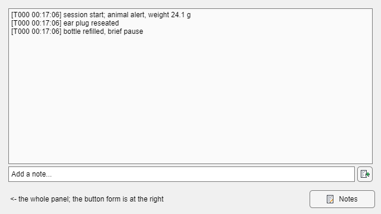

# gui.components.Notes

A line of notes, stamped with the trial it was typed on, saved with the data.

Source: `obj/+gui/@Notes/` (the component), `obj/+epsych/@SessionNotes/` (the store)



## What it does

- **One line at a time.** Type into the entry field, tap `Enter` or click the
  button beside it, and the line is committed and appended to the log above.
- **Stamped by trial**, because that is what a note has to be lined up with
  afterwards: `[T042 00:17:05] ear plug slipped`. A note typed before the
  first trial completes is trial 0, and its elapsed time reads `--:--:--`
  rather than `00:00:00` — the session had not started.
- **Saved with the data**, with no saving function edited. See
  [Where the notes end up](#where-the-notes-end-up).
- **Survives a crash.** Every commit rewrites the whole log into the session
  journal (`.epj`), so `epsych.TrialJournal.recover` brings the notes back
  with the trials.
- **Fills the row it is given.** The log box takes whatever height the host
  layout allots, so a `'1x'` row gets a full-height log and a fixed 90 px row
  gets a three-line one. There is no size to set.
- **Read-only by default**, hand-editable on demand — right-click, *Editable*.
- **Pops out** (`gui.PopOut`), and can be reduced to a single button whose
  window IS the notes.

## Usage

```matlab
% In a gui.BehaviorGUI subclass build() — registered for teardown:
obj.NotesPanel = obj.addNotes(g);            % g is a uigridlayout cell

% Wall-clock stamps, tagged to subject 2, hand-editable from the start:
obj.addNotes(g, TimeStamp="clock", Subject=2, Editable=true);

% No room for a log? One button; the notes live in the window it opens:
obj.addNotesButton(toolRow);

% From anywhere holding the runtime — a paradigm callback, a script:
RUNTIME.NOTES.add('water bottle refilled');
```

| Option | Default | Meaning |
|--------|---------|---------|
| `Subject` | `0` | Tag these notes with one subject index; `0` is the whole session. A tagged note is written only into that subject's data file. |
| `TimeStamp` | `"elapsed"` | `"elapsed"` (since session start), `"clock"` (wall clock), or `"none"` (trial number alone). |
| `Editable` | `false` | Start with the log box hand-editable. A setting the operator saved for this GUI takes precedence. |
| `FontSize` | `12` | Log and entry field, in points. |
| `Placeholder` | `'Add a note...'` | Prompt in the empty entry field. |
| `ButtonOnly` | `false` | Build just a button that opens the notes in their own window. |
| `Text` | `'Notes'` | Label on that button. |
| `PreferenceTag` | host figure's `Tag`/`Name` | Key the *Editable* setting is remembered under. |

Right-click menu: **Editable**, **Copy All** (the whole log to the clipboard,
for a notebook entry), **Clear Notes...** (confirmed first), **Open in
Separate Window**, and — in a window the component has to itself — **Keep
Window on Top**.

## The two forms

**Panel.** The log, the entry field, and the commit button, in whatever
container the GUI hands over.

**Button.** `ButtonOnly=true` builds a single button and nothing else.
Clicking it opens an ordinary `gui.PopOut` pop-out — a full notes panel in a
window of its own, over the **same store**: it opens showing every note the
session already has, and anything typed into it is a session note, saved with
the data exactly as one typed into an embedded panel would be. Clicking again
raises that window rather than opening a second one; it remembers where it was
put, can be pinned on top, and closes with the GUI that owns the button.

Both forms can coexist, and so can any number of panels: they are views over
one store, kept in step by its `NotesChanged` event.

## From gui.BehaviorBuilder

**Session Notes** is on the builder's palette under *Add-ons*, so a GUI built
by drag-and-drop can have one without any hand-written code. Its options
dialog offers the stamp format, whether the log starts hand-editable, and
**Button only** with the button's label. Picking Button only clears the
region's pop-out flag — that button already opens the window a pop-out button
would — and the generated line is `obj.addNotesButton(...)` rather than
`obj.addNotes(...)`. Two notes regions in one GUI get uniqued
`PreferenceTag`s like any other repeated component.

## Where the notes end up

Nothing is stored in the component. Notes live in `epsych.SessionNotes`,
normally `RUNTIME.NOTES`, and reach a data file two ways:

1. **`Info`, at save time.** `epsych.SessionSnapshot.forSubject` — the one
   line every saving function already calls — folds them in:

   | Field | Meaning |
   |-------|---------|
   | `Info.Notes` | struct array: `Trial`, `Time`, `Elapsed`, `Subject`, `Text` |
   | `Info.NotesText` | the log as one char block, as the operator last saw it |
   | `Info.NotesEdited` | true when the operator hand-edited the log |

   `ep_SaveDataFcn`, `cl_SaveDataFcn`, and any lab's own saving function get
   this without being touched, because none of them names the fields it writes
   inside `Info`.

2. **The journal, at commit time.** One record named `notes`, rewritten in
   full on every change. The journal reader keeps the last record of a name,
   so the recovery file always holds the newest complete log rather than
   fragments to reassemble.

Reading them back:

```matlab
S = load('MOUSE_2026_08_21.mat');
{S.Info.Notes.Text}'            % what was typed
[S.Info.Notes.Trial]            % the trial each was typed on
```

## Automatic entries

The store does not only hold what the operator types. The commit paths of the
stock GUI components record operator actions into the same log through
`epsych.SessionNotes.log(RUNTIME, fmt, ...)`:

| Action | Recorded by | Entry |
|--------|-------------|-------|
| Update Parameters commit (immediate) | `gui.components.Parameter_Update` | `Updated StimDelay: 1000 -> 1500` — one per changed parameter |
| Update Parameters commit (deferred) | `gui.components.Parameter_Update` | `Staged StimDelay = 1500 for the next trial` — the parameter still holds its old value until the dispatcher applies the trial table |
| autoCommit control edit | `gui.components.Parameter_Control` | `Updated Depth.Min: 5 -> 10` — bound property named when it is not `Value` |
| StimType selection | `gui.components.Parameter_Control` | `Updated Stim: stimgen.Tone` |
| Phase load | `gui.components.PhaseSelector` | `Loaded phase "Stage2"; updated: Depth, P_Catch` |
| Phase save | `gui.components.PhaseSelector` | `Saved phase "Stage2"` |
| Debugger hand-write | `gui.ParameterDebugger` | `Parameter Debugger wrote StimDelay = 1200` — the typed value; what the device holds after clamping is the trial record's job |

Because these ride in `RUNTIME.NOTES`, they land in `Info.Notes` and the trial
journal for **every** session — a behavior GUI does not need a `gui.components.Notes`
component, or any notes UI at all, for its data files to carry the record.
The debugger entry goes further: it is recorded even for a session running
with `BEHAVIORGUI_NONE`, since that window opens from RunExpt's Help menu.
This is standard for every `gui.BehaviorGUI` subclass, since the components
above are what its `addControl`/`addUpdateButton` helpers and the phase
selector build.

What is deliberately *not* recorded:

- **Automatic per-trial writes.** A staircase stepping `Depth`, a
  `BlockSequence` driving `StimDelay`, the dispatcher re-applying the trial
  table — these are the paradigm running, already in the trial record, and
  would flood the log. Only the operator-initiated commit paths log.
- **`addButton` toggles and triggers.** Reminder, Deliver Trials, a manual
  pellet — momentary by design (their controls carry no `Runtime`), and the
  trial record already carries their effect.
- **An edit that changed nothing.** A commit of the value the parameter
  already held records no entry.

`epsych.SessionNotes.log` never throws and no-ops without a live store or in
`ReviewMode` — the record of an action must not be able to break the action,
and a replayed session must not append to the log it is displaying.

The same principle decides *which* value each entry names. **No call site reads
the parameter back to build its note.** `hw.Parameter.get.Value` is a device
round trip on a live backend and rethrows whatever the backend throws, so a
read-back here would let the record of a successful write fail the write that
had already landed — and would cost one round trip per committed parameter.
Every entry is therefore built from values the caller already had, which means
what is recorded is the value *requested*. What the device holds after
clamping, an `Expression`, or `isRandom` is the trial record's job.

## Why it is built this way

- **A store, not a cell array in the GUI.** The notes have to outlive the
  component (a pop-out closes, a GUI is rebuilt), be reachable from a script,
  and be readable by the snapshot at save time. `epsych.SessionNotes` on the
  runtime is the only place all three can see.
- **Session-wide by default.** There is one behavior GUI per session, not one
  per subject, so one log is what an operator is actually keeping. `Subject=i`
  is there for a multi-box rig where a remark is about one animal rather than
  the room; a tagged note is filtered into that subject's file alone, and
  untagged notes go into every file.
- **The trial number, not just a timestamp.** A wall clock has to be
  reconciled with the session's own start before it means anything; the trial
  index is already the axis the data is on. The clock is carried in the record
  regardless, so nothing is lost by displaying elapsed time.
- **Edited text wins.** An operator who turns on *Editable* and fixes a line
  meant the fix. `setText` stores that text verbatim and re-parses `Records`
  from it; a line whose stamp is gone parses with `Trial = NaN` rather than
  being dropped, because discarding what someone deliberately typed is the
  worse failure. `Info.NotesEdited` tells a later reader which of the two is
  the operator's own.
- **Read-only by default.** The log is a record. Making it typeable is a
  deliberate act, remembered per GUI so a rig that wants it gets it every
  session.
- **The whole log per journal record.** Notes are typed at human rates and are
  a few hundred bytes; rewriting them costs nothing next to the certainty of
  never having to stitch fragments together after a crash.
- **A review stands down.** In `epsych.ReviewSession` the entry field and
  button are disabled and the box cannot be made editable: the notes shown are
  what the file was saved with, and there is nothing left to write to.
  `epsych.SessionNotes.fromSnapshot` is what puts them there.

## Testing

`tmp/smoke_test_behaviorbuilder.m` covers the builder path (both forms placed,
generated, lint-clean, and running against a software runtime).
`tmp/smoke_test_notes.m` is the standing check — the store, the stamp formats,
subject scoping, edited-text-wins, the journal record, the `Info` fold-in and
its round trip, both component forms, two views staying in step, and the
review-mode stand-down. It needs no display interaction.

```matlab
matlab -batch "run('tmp/smoke_test_notes.m')"
```

## See also

- `documentation/gui/gui_BehaviorGUI.md` — `addNotes`, `addNotesButton`
- `documentation/gui/gui_PopOut.md` — the pop-out window the button opens
- `documentation/epsych/epsych_ReviewSession.md` — notes in a reviewed session
- `documentation/epsych/epsych_TrialJournal.md` — the crash-recovery channel
