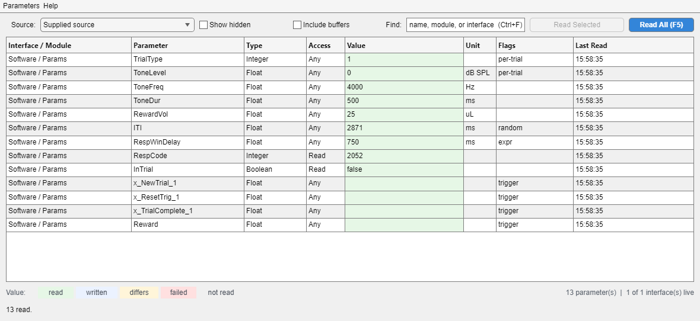

# `gui.ParameterDebugger`

A window that lists every parameter a protocol defines and lets you read or
write any of them. It answers the question a behavior GUI cannot — *is the
hardware actually holding what I think it is* — because it shows everything,
including the parameters no GUI exposes, and it works the same against any
protocol on any backend.

Opened from the session window's **Help > Diagnostics > Parameter Debugger...** (`Ctrl+E`),
or directly against a protocol, a runtime, or a bare interface array.

```matlab
% From a session window: Help > Diagnostics > Parameter Debugger... (Ctrl+E)
RX.OpenParameterDebugger

% Standalone, against anything that owns interfaces
gui.ParameterDebugger                  % binds to the open session, if any
gui.ParameterDebugger(myProtocol)      % an epsych.Protocol
gui.ParameterDebugger(RUNTIME)         % an epsych.Runtime
gui.ParameterDebugger(RUNTIME.Interfaces)
```



> Exercised headlessly by `tmp/smoke_test_parameter_debugger.m`, which drives
> it against `tmp/ParameterDebuggerMock` — a real `hw.Interface` with a value
> store of its own, so failing reads, quantised writes, and the
> connected/disconnected distinction are all covered without hardware. Run it
> after any change.

---

## Nothing is polled

Every read happens because you asked for it: a button, a double-click, or a
key. There is no timer and no auto-refresh.

That is the point. A debugger you leave open beside a running experiment must
not add hardware traffic of its own, or the thing it measures is partly the
measuring. `gui.Parameter_Monitor` is the polling display, and it is the right
tool when you want a value to update itself; this window is the one you can
trust not to.

The corollary is that a value in the table is a value *as of* the time in its
**Last Read** column — never live.

A sweep owns the window while it runs: a rebuild, an edit, or a second read
arriving mid-sweep is dropped rather than interleaved, because rebuilding the
row list underneath a running loop would attribute values to the wrong
parameters. `IsBusy` reports that state. Closing the window mid-sweep stops
it rather than erroring — which is what an operator does when a backend has
stopped answering.

## Reading

| Action | Reads |
|---|---|
| Double-click a parameter's name | that one parameter, buffers included |
| **Read Selected** (`Ctrl+Enter`), or the right-click item | every selected row, buffers included |
| **Read All** (`F5`) | every listed row except buffers and write-only parameters |

Three things are deliberately left out of a Read All sweep:

- **Write-only parameters.** `hw.Parameter.get.Value` logs a critical record
  and returns `NaN` for `Access = 'Write'`, so sweeping them would fill the
  error log with failures that are not failures. They are marked grey,
  `write-only`.
- **`Buffer` and `Coefficient Buffer` parameters.** One of them can be a
  megabyte off the device. They are marked grey, `buffer - double-click to
  read`; naming one — by double-clicking it or selecting it — always reads it,
  and ticking **Include buffers** puts them into the sweep.
- **Parameters whose object has been deleted**, which is what reloading a
  config leaves behind. Rebuild the list with `Ctrl+R`.

A read that throws is reported in the row and counted in the status line,
which quotes the first failure; the exception itself goes to the log
(**Help > Diagnostics > Open Current Error Log**). One dead parameter never stops a sweep.

## Colour is the read report

The **Value** cell carries the state of the last thing that happened to it:

| Colour | Meaning |
|---|---|
| pale green | the read came back |
| blue | this window wrote the value, and it read back as written |
| amber | it was written, but reads back as something else |
| pale red | the read or the write threw, or the text could not be parsed |
| grey | cannot be read: write-only, or a buffer the sweep skipped |
| uncoloured | never read |

The same table is in the window: the legend under the grid names each colour,
and hovering one gives the fuller description — what the tint means and, for
the two that need it, what to do about it.

The last one matters: a row that has never been read stays uncoloured, so *I
have not asked yet* never looks like *it came back empty*.

Amber is not an error. Clamping to `Min`/`Max`, an `Expression`, and a coarse
hardware quantiser all legitimately change a written value, and the note
column shows both numbers — `wrote 5.4, read 5` — so you can tell which.

Hidden parameters are greyed across the whole row, over whatever tint the
value cell has.

## Writing

Type into the **Value** cell. What is accepted depends on the parameter's
`Type`:

| `Type` | Accepts |
|---|---|
| `Float`, `Integer`, `Undefined` | a number (`1500`), an array literal (`[1 2 3]`), or an arithmetic expression (`0:0.1:1`, `2*750`) |
| `Boolean` | `true`/`false`, `1`/`0`, `on`/`off`, `yes`/`no` |
| `String`, `File` | the text, verbatim |
| `Buffer`, `Coefficient Buffer` | an array literal, up to 24 elements |
| `StimType` | nothing — edit a stimulus in the Protocol Designer or the Stimulus Player |

Numeric text is evaluated with `str2num`, which is `eval`, so it is first
checked against a numeric-literal pattern. Anything containing an identifier
is refused before it gets there: a cell that could run arbitrary code while
pointed at live hardware would be a trap, not a convenience.

The *result* is then checked as well, because arithmetic on digits alone can
still produce something no backend can send: `1e999` overflows to `Inf` and
`(-1)^0.5` is complex. Only a real, finite number is written.

Every write is followed immediately by a read-back, because on a live backend
the only proof a write landed is what the device returns afterwards. A
write-only parameter has no read-back, so what the cell shows is the value
after `Min`/`Max` clamping — what `set.Value` actually stored — and the note
says it could not be confirmed. Rows the window refuses to write — read-only
parameters, triggers, values too large to be a literal — say so in the status
line rather than failing quietly.

Two flags explain most writes that appear not to stick:

- **`expr`** — the parameter has an `Expression`, which `set.Value`
  re-evaluates on every dispatch and which overrides whatever you assign.
- **`per-trial`** — it has more than one design-time level and
  `UpdateEveryTrial` is set, so the trial dispatcher rewrites it at the start
  of the next trial.

Triggers are never fired by typing. Select the row and use **Fire Trigger**
(the `Parameters` menu, or right-click).

## What is listed

The **Source** dropdown offers one entry per subject in `RunExpt.CONFIG`, plus
the live session's interfaces when a run is in progress. Before a run these are
the same objects a run will use — `ExptDispatch` hands `RUNTIME` subject 1's
protocol interfaces — which is why the window is worth opening with a config
merely loaded. The entry a run is actually using is marked `- live`.

> Only subject 1's interfaces are ever connected; subjects 2+ hold their own
> unconnected copies of the same protocol. Reads against those return the
> values the host holds, marked `(offline)`. See
> [plans/multi-subject-support.md](../../plans/multi-subject-support.md).

`(offline)` on a timestamp is the single most useful thing in the window when
every value looks like the design-time default: it means the backend was never
asked, because it is not connected. The count on the right — `13 parameter(s)
| 1 of 1 interface(s) live` — says the same thing for the whole source, and is
recomputed after every sweep as well as after every rebuild.

**Show hidden** lists parameters whose `Visible` flag is false.

## Find

**Find** filters on interface, module, and parameter name together, and it
filters **as you type** — the list narrows on every keystroke, before you press
Enter. That is affordable because filtering touches nothing but objects already
in memory: it walks the interface's parameter handles and asks no backend for
anything. A window that polled could not do it.

- **Regex** reads what you typed as a case-insensitive regular expression
  matched against `interface / module  name`, instead of as a substring. It is
  off by default because the characters a regex reads specially — `.`, `(`,
  `[` — are ordinary characters in parameter names.
- A pattern that is only half typed — `Freq[`, `(Freq|` — leaves the list
  alone and turns the box amber, rather than emptying the table on the opening
  bracket and filling it again on the closing one. MATLAB's own `regexp` does
  not object to those, so the window recognises the four states a pattern
  passes through on its way to being written: an open group, an open class, an
  open quantifier, and a trailing backslash.
- **Esc**, or the **X** beside the box, clears it. Escape only closes the
  window once the box is already empty.
- A filter change **keeps the read report**. Narrowing a list is not new
  evidence about the parameters left in it, so the colours and values carry
  across, matched on the parameter handle. Only a rebuild (`Ctrl+R`, a source
  change, a config load) starts from a clean slate — those replace the
  parameter objects, and a value read from an object nothing refers to any more
  is not evidence about the one now in front of you.
- A rebuild keeps the filter, too: refreshing in the middle of a search does
  not put two hundred rows back in front of you.

## Sorting and column order

Click a header to sort; drag one to move a column. Both are display-only, and
neither changes what an action does: every callback here works from the **data**
index `uitable` reports (`Selection`, `evt.Indices`,
`InteractionInformation.Row`), never the `Display*` counterpart a header click
reorders. That distinction is the whole reason this was safe to turn on —
getting a row index wrong here means writing to the wrong parameter on live
hardware.

Sorting is lexicographic on the displayed text, because every column is char
(the **Value** column has to hold a number, an array literal, a file path, and
`<stimgen.Tone>` in different rows, and `ColumnFormat` is per column, not per
row). The natural order — interface, then module, then declaration order — is
what the list is built in, and it is the order the Protocol Designer and the
circuit already use.

## Tracking a value over time

The table answers *what is it now*; **Track Selected** (`Ctrl+T`, or the
right-click item) answers *is it moving*. It opens a
[`gui.ParameterTracker`](gui_ParameterTracker.md): a live plot of the selected
parameters against seconds since tracking started, one colour per parameter.

Only scalar numeric and boolean parameters can be plotted, so a selection that
also holds a buffer or a string tracks what it can and says what it left out.
By default the parameters join the tracker this window opened last — comparing
two values on one time axis is the usual reason to track a second one — and
**Track Selected in New Plot** always opens another.

That window **polls**, which is exactly what this one refuses to do. It is a
separate window with its own timer and its own rate control for that reason:
polling is something you turn on deliberately and can see running.

## The Flags column

| Flag | Set when |
|---|---|
| `hidden` | `Visible` is false |
| `trigger` | `isTrigger` |
| `array` | `isArray` |
| `random` | `isRandom` |
| `expr` | `Expression` is non-empty |
| `set-once` | `SetOnce` — written on the first dispatch only |
| `per-trial` | more than one design-time level, and `UpdateEveryTrial` |

## Shortcuts and the right-click menu

| Key | Action |
|---|---|
| `F5` | Read All |
| `Ctrl+Enter` | Read Selected |
| `Ctrl+R` | rebuild the list |
| `Ctrl+F` | jump to the Find box |
| `Ctrl+T` | Track Selected in a live plot |
| `Ctrl+C` | copy the table (selection, else all) as TSV |
| `Esc` | clear the Find box; close the window when it is already empty |

Right-click adds **Track Selected**, and **Assign to Command Window (P)**, which puts the selected
`hw.Parameter` in the base workspace as `P` — the handoff point where the
window stops and the command line takes over, in the spirit of the session
window's *Assign RUNTIME to Command Window*.

## What is remembered

Only the window position, under the `epsych2_gui_ParameterDebugger`
preference group, written when the window is closed. Nothing else persists:
which source, what is filtered, how the columns are sorted and ordered, and
everything read are all properties of one debugging session and would be
misleading restored into the next.

## Testing

```matlab
matlab -batch "run('tmp/smoke_test_parameter_debugger.m')"
```

114 assertions over a mock backend and a live `epsych.RunExpt`: that hidden
parameters are opt-in, that a sweep skips what it should and reports what
fails, that each colour follows its state, that a double-click on a name reads
and a double-click in the Value cell does not, that each value type parses,
that read-only parameters, triggers, and code in a value cell are all refused,
that a disconnected rig is marked offline, and that the window opens from the
session window's Help menu and closes cleanly.

It also covers what goes missing underneath it — a parameter deleted out of a
protocol, an interface deleted out of the source array, an edit event carrying
a row index the list no longer has, the window itself closed mid-sweep — and
that each kind of empty table says which kind it is.

A block of it exists because a review found the bugs after the first version
was written, and each one is now pinned: a multi-row selection acting on only
its first row, `str2double` accepting a complex or overflowing literal ahead of
the safety pattern, a write leaving the row's editable flag stale, a sweep
running with the re-entrancy guard down, and reopening the window discarding
where the operator had put it.

It also covers the Find box as a live control — that the list narrows while
typing rather than on Enter, that a regex matches and a half-typed one does
not disturb the list, that clearing restores every row and that Escape clears
before it closes — and the tracker: that a selection containing a buffer plots
only what it can, that samples arrive on the timer, that a line added later has
no history invented for it, and that closing the plot stops its timer.

See also: [gui_ParameterTracker.md](gui_ParameterTracker.md) — the live plot
this window opens, [gui_Parameter_Monitor](Parameter_Monitor.md) — the polling display,
[Parameter_Control.md](Parameter_Control.md) — one parameter bound to one
widget, [gui_BehaviorGUI.md](gui_BehaviorGUI.md),
[../hw/hw_Parameter.md](../hw/hw_Parameter.md),
[../overviews/RunExpt_SelfTest.md](../overviews/RunExpt_SelfTest.md) — the
other window on the Help menu.
