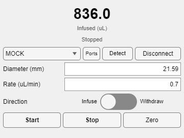

# `gui.components.SyringePump`

An operator panel for a New Era NE-1000 syringe pump. It answers the four
questions a rig operator has about a reward pump — *how much has it
dispensed, which port is it on, what syringe is loaded, and how fast is it
running* — and adds a direction switch, a TTL trigger switch, and
Start / Stop / Zero buttons so the syringe can be driven by hand between
trials.

```matlab
% Inside a gui.BehaviorGUI build method
obj.add('gui.components.SyringePump', panelReward);
obj.add('gui.components.SyringePump', panelReward, Rate = 1.5, Diameter = 14.43);

% Only the readout and the manual buttons; the protocol owns the rest
obj.add('gui.components.SyringePump', panelReward, Sections = ["Volume" "Status" "Triggers"]);

% Standalone: no protocol, pick a port in the panel and connect
f = uifigure(Name = 'Pump');
p = gui.components.SyringePump([], f);
```



> **Status: under development**, like the [`hw.NE1000`](../hw/hw_NE1000.md)
> backend it drives. Exercised headlessly by
> `tmp/smoke_test_syringepump_gui.m` against the in-process pump mock; not yet
> run against a physical pump.

---

## What it is built over

`gui.components.SyringePump(source, container)` takes any of three sources:

| `source` | The panel drives |
|---|---|
| an `hw.NE1000` | that interface |
| an `epsych.Runtime` (what `gui.BehaviorGUI` passes) | the first `hw.NE1000` among its `Interfaces` |
| `[]`, or a runtime with no pump | an offline `hw.NE1000` it constructs itself |

The third case is what makes the panel usable on its own and keeps a BehaviorGUI
opening against a runtime with no hardware attached (`epsych.SelfTest` check
I6). A panel only deletes the interface on teardown when it created it; one
borrowed from a running session outlives the window.

Settings made while disconnected are held in the panel and pushed once the
pump answers, so the operator can set up before the cable is in.

---

## The readout

The large number is the accumulated volume the pump reports for the direction
currently selected — *Infused* when pushing, *Withdrawn* when pulling —
refreshed by the panel's own timer, 4 Hz by default (`UpdatePeriod`). Both
accumulators come from a single `DIS` round trip through the interface's
cache, and the status line under it carries the pump's prompt (`Stopped`,
`Infusing`, …) or its alarm, colored green while the motor turns and red on
an alarm.

Volume is displayed in `VolumeUnits` (`'mL'` by default; `'uL'`, or `'auto'`
to follow the pump), which the operator picks from the right-click **Units**
menu. The pump chooses its own units from the syringe diameter — µL below
14 mm, mL at or above — and reports three decimals either way, so at 21.59 mm
the readout moves in 1 µL steps. `hw.NE1000.DispensedUnits` records what the
pump last said, and the panel converts from that. Changing the readout units
writes nothing to the pump: it is a display choice, and only a display
choice.

The accumulators reset on pump power-up, on a diameter change, and at 9999,
so read *differences* as the trustworthy quantity — the same caveat that
applies to `VolumeInfused` in the trial data.

---

## Settings

Each is a public property, so a paradigm can drive the panel exactly as a
keystroke does — `obj.Rate = 1.2` moves the control *and* writes the pump:

| Property | Default | Notes |
|---|---|---|
| `Diameter` | `21.59` mm | Inside diameter of the loaded syringe (0.1–50). Scales every rate and volume the pump computes. Rejected while the pump is running. |
| `Rate` | `0.7` | In `RateUnits` (mL/min by default). The usable range depends on the diameter; an out-of-range value is rejected by the pump. |
| `RateUnits` | `'MM'` | `UM` µL/min, `MM` mL/min, `UH` µL/hr, `MH` mL/hr. Assigning it converts `Rate` with it and switches the interface to match. |
| `VolumeUnits` | `'mL'` | `'uL'`, `'mL'`, or `'auto'` (whatever the pump reports). Display only. |
| `Direction` | `'Infuse'` | `'Infuse'` pushes (reward), `'Withdraw'` pulls (refill). Rejected while pumping toward a volume target. |
| `TTLTrigger` | `false` | Whether the pump's own TTL trigger input (DB-9 pin 2) may start and stop it. |

A write the pump refuses is not an error: the panel keeps the operator's
value, tints the control, says so on the status line, and logs the pump's
reason. Nothing throws out of a button callback.

### The TTL trigger: a switch here, a mode in code

`TTLTrigger` is the one control that changes *what starts the pump* rather
than how it runs. With it enabled, the pump's trigger input starts and stops
it directly, so a rig can gate reward from a digital line with no host round
trip. The pump keeps the setting through a power cycle, so it is asserted on
every connect in both directions — a session that does not ask for TTL control
turns off a trigger someone left enabled at the keypad.

Which trigger mode that is — level, foot switch, start-only, and the rest of
[`hw.NE1000.TRIGGER_MODES`](../hw/hw_NE1000.md#the-ttl-operational-trigger) —
is **programmatic only**: a construction option and the `TriggerMode` property,
with no control, no menu entry, and nothing remembered between sessions. The
mode follows how pin 2 is wired, which belongs to the paradigm rather than to
the operator; the checkbox's tooltip and the menu entry name the current one
so nobody has to guess what the switch will do.

```matlab
obj.add('gui.components.SyringePump', panelReward, TriggerMode = 'ST', TTLTrigger = true);
```

Left unset, `TriggerMode` adopts whatever the interface is configured for, so a
protocol's choice survives a panel opening over its pump. Its default is `'LE'`
(rising edge starts, falling edge stops).

### Units: the operator's, and the interface follows

Rate is written in `RateUnits` — µL or mL, per minute or per hour, `'MM'`
(mL/min) by default — and the volume readout in `VolumeUnits`. Both are
public properties and both are on the right-click **Units** menu, so the
operator picks the units their protocol is written in rather than converting
in their head at the rig.

**The panel does not convert values on the wire — it changes the pump's
units.** The command grammar allows **4 digits plus one decimal point**, so
0.7 mL/min written in the interface's default mL/hr survives (`42`) but
0.7 µL/min written in mL/min does not (`0.001`, a 43 % error). Rather than
convert every write, the panel puts the interface into the units it displays
on attach, logs the change at verbosity 1, and relabels the `Rate` parameter
so the trial table and any monitor showing it stay honest. Pass
`RateUnits='MH'` (etc.) to open in a protocol's own units instead.

**Changing the units does convert `Rate` — once.** Units are how the rate is
written down, not how fast the pump runs, so switching from µL/min to mL/min
turns 500 into 0.5 and the syringe never changes speed. A rate the new units
cannot express — under 0.01, or 10000 and over — is logged as such, since the
pump can only be told four digits of it.

Two consequences worth knowing at the rig:

- **A protocol column that writes `Rate` is in the panel's units too.** The
  interface belongs to the session, so a trial table authored in µL/min and a
  panel displaying mL/min would re-assert the same number meaning different
  things. State `RateUnits` in the build method when the protocol owns the
  rate (see [examples/syringepump](../../examples/syringepump/README.md)).
- **The units cannot change while the pump is running.** The pump refuses a
  rate carrying units mid-dispense, and `hw.NE1000` falls back to the bare
  value — which the pump would take in its *old* units. The panel refuses the
  change instead and says so on the status line.

### Applying versus reading

`ApplyOnStart` (default `true`) pushes `Diameter`, `Rate`, `Direction`, and
`TTLTrigger` to a connected pump at construction, skipping any the pump
already agrees with —
which matters most for the diameter, since **writing a diameter resets the
dispensed-volume accumulators**. `ApplyOnStart=false` reads the pump's current
values into the panel instead, which is what a second view of an already
configured pump wants (and what `createPopOut_` uses).

`refresh()` re-reads everything on demand; the timer alone only polls the
volumes and status.

---

## Showing only part of the panel

Which controls appear is programmatic. `Sections` lists the parts that are
shown; assigning it — or calling `show` / `hide` — reflows the panel at any
time, and the operator can do the same from the right-click **Show** menu.

| Section | What it is |
|---|---|
| `Volume` | the large readout and its caption |
| `Status` | the pump status / alarm line |
| `Port` | the port dropdown, its refresh, and the connect button |
| `Detect` | the port-probing button |
| `Diameter`, `Rate`, `Direction` | the three settings rows |
| `TTL` | the TTL trigger checkbox |
| `Start`, `Stop`, `Zero` | the buttons, individually |

Group aliases are accepted anywhere a name is: `Connection` (Port + Detect),
`Settings` (Diameter + Rate + Direction + TTL), `Triggers` (Start + Stop + Zero),
plus `All` and `None`. `Sections` always reads back as the individual names
it resolved to, in layout order. An unrecognized name is logged and skipped —
a typo in a build method must not stop the GUI opening.

```matlab
p.Sections = ["Volume" "Status"];       % readout only
p.hide(["Diameter" "Connection"])
p.show("Direction")
p.isSectionVisible("Triggers")          % true only if all three buttons show
```

Hiding is only hiding: the controls keep their state and their bindings, so
`obj.Rate = 1.2` still writes the pump with the rate row hidden, and every
setting stays adjustable from the right-click **Set Value** menu. Rows are
built once and collapse to zero height, so toggling one costs nothing.

With neither `Volume` nor `Status` shown there is nothing to read out, so the
poll timer stops and the panel costs the pump no serial traffic at all.

## The right-click menu

- **Show ▸** — one checkable entry per section, plus **Show All** and
  **Reset to Default** (back to the layout the hosting GUI asked for).
- **Set Value ▸** — Diameter…, Rate… (each labeled with its current value and
  prompting through `inputdlg`), Direction ▸, TTL Trigger ▸ (labeled with its
  state and the mode in force), Port ▸ with **Detect…**, and
  Connect / Disconnect. Everything the panel can change is reachable here
  whether or not its row is showing, which is what makes hiding a row safe.
- **Units ▸** — **Rate ▸** µL/min, mL/min, µL/hr, mL/hr, and **Volume ▸** µL,
  mL, or *Follow the pump*, each labeled with what is in force. Choosing rate
  units converts `Rate` with them; choosing volume units only relabels the
  readout.
- **Refresh From Pump**, **Refresh Port List**, **Zero Dispensed Volume**.
- **Open in Separate Window** ([gui.PopOut](gui_PopOut.md)).

## What is remembered

Changes the *operator* makes in the panel — through a control, the value
menu, or the show menu — are saved with `getpref`/`setpref`, keyed to the
hosting figure's `Tag`/`Name` or an explicit `PreferenceTag`, and restored the
next time a panel opens with that key: the section layout, the selected port,
the units, and the diameter, rate, direction, and TTL trigger state they set.
A remembered rate is stored with the units it was typed in and converted into
whatever units the next panel opens in, so restoring it never changes how fast
the pump runs. `TriggerMode` is the exception among the settings — it has no
control, so there is no operator change to remember.

Changes a *paradigm* makes (`p.Rate = ...` from code) are not saved — they are
the paradigm's to reassert, not something to resurrect a session later.

Each setting resolves in this order:

1. what the caller passed to the constructor,
2. what the operator left behind,
3. the built-in default (21.59 mm, 0.7 mL/min, Infuse, TTL off, mL readout,
   all sections).

That first step is why `Diameter`, `Rate`, `Direction`, `TTLTrigger`,
`TriggerMode`, `RateUnits`, `VolumeUnits`, `Sections`, and `Port`
have no defaults in the `arguments` block: an option that was never supplied
is simply absent, which is what distinguishes *the caller did not say* from
*the caller asked for the default*.

`Sections` is the one exception to the ordering, following `gui.components.NextTrial`'s
precedent for saved field selections: the caller's value is the **default**
layout, and a selection the operator saved overrides it. **Reset to Default**
restores the caller's layout and forgets the saved one. `Port` is the other:
a port the interface is already configured for (a protocol saved it with the
pump) outranks the panel's memory.

## The port row

The `Port` and `Detect` sections add the port controls:

- a dropdown of every serial port the machine reports, plus the port already
  in use (an open port is missing from the *available* list) and the last one
  selected here;
- **Ports** re-reads that list, for a converter plugged in after the window
  opened;
- **Detect** probes every port for a pump answering `VER` at the interface's
  address and baud rate (`hw.NE1000.findPumpPort`) and connects to what it
  finds;
- the connect button, whose label follows what pressing it would do:
  **Connect**, **Disconnect**, or **Reconnect** when the selection no longer
  matches the open link.

Connecting runs `hw.NE1000`'s full handshake, which stops the pump before
touching any setting. A missing pump reports in the panel rather than
throwing.

---

## Buttons

The `Start`, `Stop`, and `Zero` sections:

- **Start** — `RUN`. With the pump's `Volume` target set, it dispenses that
  volume and stops itself; with `Volume` 0 it runs until **Stop**. The panel
  deliberately does not expose `Volume`: per-trial dose is the trial table's
  job (see the reward pattern in [hw_NE1000.md](../hw/hw_NE1000.md)).
- **Stop** — `STP`.
- **Zero** — stops the pump, then clears both accumulators (the pump only
  accepts `CLD` while stopped).

The pop-out is a second panel over the *same* pump, opened with the host's
sections and `ApplyOnStart=false` so it never re-asserts settings behind the
host's back; both panels poll, so the pump answers two `DIS` queries per
period.

---

## Options

The eight marked *remembered* fall back to the operator's saved configuration
when the caller says nothing; the rest take their default outright.

| Option | Default | Meaning |
|---|---|---|
| `Diameter` | `21.59` (remembered) | Syringe inside diameter, mm. |
| `Rate` | `0.7` (remembered) | Pumping rate in `RateUnits`. |
| `Direction` | `'Infuse'` (remembered) | `'Infuse'` or `'Withdraw'`. |
| `TTLTrigger` | `false` (remembered) | Whether the pump's TTL trigger input may start it. |
| `TriggerMode` | the interface's, else `'LE'` | Which trigger mode that is. Programmatic only; never remembered. |
| `Sections` | `"All"` (remembered, and the reset target) | Which parts of the panel are shown. |
| `Port` | the interface's, else remembered | Port to preselect. |
| `RateUnits` | `'MM'` (remembered) | `UM` µL/min, `MM` mL/min, `UH` µL/hr, `MH` mL/hr. Applied to the interface; a remembered `Rate` is converted into these. |
| `VolumeUnits` | `'mL'` (remembered) | `'uL'`, `'mL'`, or `'auto'` (follow the pump). |
| `UpdatePeriod` | `0.25` | Readout period, seconds. |
| `ApplyOnStart` | `true` | Push the settings at construction, or read the pump's. |
| `FontSize` | `12` | Base font size. |
| `PreferenceTag` | `''` | Key for the remembered configuration; defaults to the hosting figure. |

## Methods

`show`, `hide`, `isSectionVisible`, `connect`, `disconnect`, `detectPort`,
`refreshPorts`, `startPump`, `stopPump`, `zeroVolume`, `refresh`,
`startPolling`, `stopPolling`, plus `popOut` / `closePopOut` / `hasPopOut`
from the mixin.

---

## Testing

```matlab
matlab -batch "run('tmp/smoke_test_syringepump_gui.m')"
```

The test builds panels over a connected mock pump, an `epsych.Runtime`, and
nothing at all, and asserts the writes on the simulated pump's state, so the
whole `hw.NE1000` protocol path runs underneath it. It also drives the
right-click menu through its own callbacks — hiding a section, setting a value
from a hidden row, switching units, resetting to default — and reopens panels
against the same `PreferenceTag` to check what is and is not remembered. The
units cases pin down what the conversion must preserve: the pump's speed
across a switch, the original number across a round trip, and a remembered
rate across a session.

See also: [hw_NE1000.md](../hw/hw_NE1000.md), [gui_BehaviorGUI.md](gui_BehaviorGUI.md),
[gui_PopOut.md](gui_PopOut.md), [Parameter_Monitor.md](Parameter_Monitor.md).
