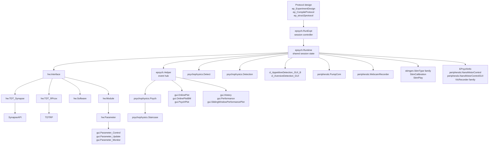

# EPsych Class Map

This document complements the architecture overview with two class-oriented views of the toolbox:

- a strict inheritance map for the major classes
- a runtime dependency map showing how the major classes interact during a running session

The emphasis is on the classes developers are most likely to touch when changing experiment startup, runtime behavior, hardware integration, online analysis, or live GUIs.

## Inheritance map

This view shows inheritance only. To keep the tree readable, detailed MATLAB base types are moved into the summary tables below.

### Core runtime and hardware

```text
EPsych major classes
├─ epsych
│  ├─ RunExpt
│  ├─ Runtime
│  ├─ Helper
│  ├─ BitMask
│  ├─ ModeChangeEvent
│  └─ TrialsData
├─ hw
│  ├─ Interface
│  │  ├─ TDT_Synapse
│  │  ├─ TDT_RPcox
│  │  └─ Software
│  ├─ Module
│  ├─ Parameter
│  └─ DeviceState
└─ top-level
   └─ PRGMSTATE
```

### Analysis, stimuli, and GUI

```text
Analysis and GUI classes
├─ psychophysics
│  ├─ Psych
│  │  └─ Staircase
│  ├─ Detect
│  └─ Detection
├─ stimgen
│  ├─ StimType
│  │  ├─ Noise
│  │  │  ├─ AMnoise
│  │  │  └─ AttackModNoise
│  │  ├─ Tone
│  │  ├─ FMtone
│  │  ├─ multiTone
│  │  └─ ClickTrain
│  ├─ StimCalibration
│  ├─ StimPlay
│  ├─ StimGenInterface
│  └─ StimGenInterface_Simple
└─ gui
   ├─ Helper
   │  └─ Triggers
   ├─ Parameter_Control
   ├─ Parameter_Monitor
   ├─ Parameter_Update
   ├─ GenericTimer
   ├─ MicrophonePlot
   ├─ FilenameValidator
   ├─ History
   ├─ OnlinePlot
   ├─ OnlinePlotBM
   ├─ Performance
   ├─ PhaseSelector
   ├─ PsychPlot
   ├─ SlidingWindowPerformancePlot
   └─ StaircaseTraining
```

### Support and legacy branches

```text
Support and task-specific classes
├─ peripherals
│  ├─ PumpCom
│  ├─ WebcamRecorder
│  ├─ NanoMotorControl
│  └─ NanoMotorControlGUI
├─ helpers
│  ├─ EPsychInfo
│  ├─ VlcRecorder
│  └─ VlcRecorderGroup
├─ cl
│  ├─ cl_AppetitiveDetection_GUI_B
│  └─ cl_AversiveDetection_GUI
├─ TDTfun
│  ├─ TDTRP
│  ├─ SynapseAPI
│  └─ BH32
└─ runtime/guis
   └─ ep_GenericGUITimer
```

### Key base classes

| Area | Root class | Base type | Role |
| --- | --- | --- | --- |
| epsych | `RunExpt` | `handle` | Main session controller GUI |
| epsych | `Runtime` | `handle & dynamicprops` | Shared runtime state container |
| hw | `Interface` | `matlab.mixin.Heterogeneous & matlab.mixin.SetGet` | Abstract hardware API |
| hw | `Module` | `handle` | Container for grouped parameters |
| hw | `Parameter` | `matlab.mixin.SetGet` | Runtime parameter wrapper |
| psychophysics | `Psych` | `handle & matlab.mixin.SetGet` | Abstract analysis base |
| stimgen | `StimType` | `handle & matlab.mixin.Heterogeneous & matlab.mixin.Copyable & matlab.mixin.SetGet` | Abstract stimulus base |
| gui | `Helper` | `handle` | Shared GUI helper base |

## Runtime dependency map

This view is not inheritance. It shows the main runtime relationships during a typical session. The Mermaid diagram gives the fast overview, and the short tree below keeps the same information in plain text.



### Layered runtime view

```text
Protocol authoring
├─ ep_ExperimentDesign
├─ ep_CompileProtocol
└─ ep_struct2protocol
   ↓
Session control
└─ epsych.RunExpt
   ↓
Runtime state and events
├─ epsych.Runtime
└─ epsych.Helper
   ↓
Hardware layer
├─ hw.Interface
│  ├─ hw.TDT_Synapse → SynapseAPI
│  ├─ hw.TDT_RPcox → TDTRP
│  └─ hw.Software
└─ hw.Module → hw.Parameter
   ↓
Analysis and visualization
├─ psychophysics.Psych → psychophysics.Staircase
├─ psychophysics.Detect
├─ psychophysics.Detection
├─ gui.Parameter_Control / gui.Parameter_Update / gui.Parameter_Monitor
├─ gui.OnlinePlot / gui.OnlinePlotBM / gui.PsychPlot
└─ gui.History / gui.Performance / gui.SlidingWindowPerformancePlot
   ↓
Task and support branches
├─ cl_AppetitiveDetection_GUI_B / cl_AversiveDetection_GUI
├─ peripherals.PumpCom
├─ peripherals.WebcamRecorder
├─ peripherals.NanoMotorControl / peripherals.NanoMotorControlGUI
├─ stimgen.StimType family / StimCalibration / StimPlay
└─ EPsychInfo / VlcRecorder family
```

### Main dependency patterns

| Pattern | Typical direction |
| --- | --- |
| Session lifecycle | `epsych.RunExpt -> epsych.Runtime` |
| Hardware control | `epsych.Runtime -> hw.Interface -> hw.Module -> hw.Parameter` |
| Backend bridge | `hw.TDT_Synapse -> SynapseAPI`, `hw.TDT_RPcox -> TDTRP` |
| Online analysis | `epsych.Helper events -> psychophysics.*` |
| Parameter GUIs | `gui.Parameter_* <-> hw.Parameter` |
| Task GUIs | `cl.* -> epsych.Runtime -> psychophysics.* + gui.*` |

## Practical reading order

If you are tracing a live experiment session, the fastest route through the code is usually:

1. `epsych.RunExpt`
2. `epsych.Runtime`
3. `hw.Interface` and the active backend subclass
4. `hw.Module` and `hw.Parameter`
5. task GUI classes and psychophysics analysis classes attached to the runtime

If you are tracing online plots or task summaries, start with the task GUI class and then follow its references into `psychophysics.*`, `gui.*`, and the `Runtime.Helper` event path.

## Related documentation

- Architecture overview: [Architecture_Overview.md](Architecture_Overview.md)
- Runtime details: [../epsych/epsych_Runtime.md](../epsych/epsych_Runtime.md)
- Hardware interfaces: [../hw/hw_Interface.md](../hw/hw_Interface.md)
- Hardware modules: [../hw/hw_Module.md](../hw/hw_Module.md)
- Hardware parameters: [../hw/hw_Parameter.md](../hw/hw_Parameter.md)
- Psychophysics base class: [../psychophysics/psychophysics_Psych.md](../psychophysics/psychophysics_Psych.md)
- RunExpt walkthrough: [RunExpt_GUI_Overview.md](RunExpt_GUI_Overview.md)

