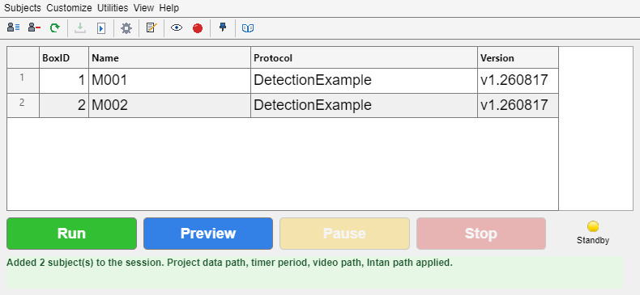

# epsych.RunExpt GUI overview



This document is a practical guide to using the `epsych.RunExpt` session GUI to configure subjects, load and save session configurations, and run (or preview) behavioral experiments. It is written for experiment operators. If you need to change how the session controller works internally, start with [Architecture_Overview.md](Architecture_Overview.md) and the class source in [obj/+epsych/@RunExpt/](../../obj/+epsych/@RunExpt/).

The window above shows a loaded configuration with two subjects assigned to boxes 1 and 2; see [Main window layout](#3-main-window-layout) for what each area does.

## Table of contents

- [1) Launching the GUI](#1-launching-the-gui)
- [2) Quick-start workflow](#2-quick-start-workflow)
- [3) Main window layout](#3-main-window-layout)
- [4) Working with protocols](#4-working-with-protocols)
- [5) Running, pausing, stopping, and saving data](#5-running-pausing-stopping-and-saving-data)
- [6) Config files (`*.ecfg`)](#6-config-files-ecfg)
- [7) Customization](#7-customization)
- [8) Menus reference](#8-menus-reference)
- [9) Keyboard shortcuts](#9-keyboard-shortcuts)
- [10) Notes and common gotchas](#10-notes-and-common-gotchas)
- [Related documentation](#related-documentation)

## 1) Launching the GUI

In MATLAB, run:

```matlab
epsych.RunExpt
```

Optional: load a saved configuration immediately:

```matlab
epsych.RunExpt("C:\path\to\mySession.ecfg")
```

Optional: load a configuration and start the run in one step:

```matlab
epsych.RunExpt("C:\path\to\mySession.ecfg", Run=true)
```

Notes:

- Only one RunExpt window is kept open at a time. If one already exists, calling `epsych.RunExpt` brings it to the foreground and reuses it.
- Closing the window while an experiment is running will prompt you and will stop the experiment if you proceed.

## 2) Quick-start workflow

A typical session looks like this:

1. (If needed) Build and save a protocol (`*.eprot`) using the [Protocol Designer](../design/ProtocolDesigner_UserGuide.md).
2. Launch the GUI: `epsych.RunExpt`.
3. (Recommended) Set a default data directory: **Customize → Customize... → Data Path**.
4. Add one or more subjects:
   - Click the **Subjects** toolbar button (or **Subjects → Subjects & Projects...**, Ctrl+B).
   - Pick a project on the left, tick the animals running today, and press **Add Checked to Session**. Each one gets a free box and the protocol it last ran.
   - For an animal that is not in the roster yet, use **New Subject...** in the same window; it opens the usual subject dialog and files the animal into the selected project.
   - See [Subjects & Projects](../gui/gui_SubjectManager.md) for the full window.
5. (Optional) Sanity check the protocol/trials:
   - Right-click the subject row and choose **View Trials** to preview compiled trials.
6. Start the session:
   - Click **Preview** for a dry-run mode (data marked as test), or **Run** to record.
7. During the session:
   - Use **Pause** if needed.
   - Use **Stop** to end the session.
8. After stopping:
   - Click the **Save Data** toolbar button and save each subject's data file.
9. (Optional) Save your session configuration for reuse:
   - **Config → Save Config...**

## 3) Main window layout

### 3.1 Loaded configuration

A strip directly above the subject table names the configuration currently in effect, as **Config: `<filename>.ecfg`**. Hover it for the full path — configs with the same name routinely live under different subject folders, and this is the only place the session shows which one it read. It reads **Config: (none loaded)** until a config is loaded or saved, and it updates whenever one is loaded (including **Refresh Config** and **Recent Configs**) or saved under a new name.

### 3.2 Subject table (left)

The main table shows one row per configured subject, with columns:

- **BoxID**: behavioral box identifier.
- **Name**: subject name (must be unique within the session).
- **Protocol**: the protocol filename associated with that subject. Subjects whose loaded protocol is older than the version saved on disk are flagged so you know an update is available.

Selecting a row prints the selected subject's details to the MATLAB command window. Right-clicking a row opens the protocol context menu (see [Working with protocols](#4-working-with-protocols)).

### 3.3 Toolbar

A toolbar under the menu bar gives one-click access to the most common menu actions. Hover any tool for its tooltip. From left to right:

- **Browse Configs** (folder with magnifier): opens the config browser — same as **Config → Browse Configs...** (Ctrl+C).
- **Load Config** (open folder): loads a config file — same as **Config → Load Config...** (Ctrl+L).
- **Refresh Config** (circular arrow): reloads the currently loaded config file from disk — same as **Config → Refresh Config** (Ctrl+R).
- **Save Config** (floppy disk): saves the session configuration — same as **Config → Save Config...** (Ctrl+S).
- **Subjects** (person beside a list): opens the [Subjects & Projects](../gui/gui_SubjectManager.md) window, where you pick several animals at once and commit them to the session — same as **Subjects → Subjects & Projects...** (Ctrl+B). Available in every state, including during a run; it is the commit action inside it that refuses while a session is running.
- **Remove Subject** (person with a red minus): removes the selected subject (or clears the session if there is only one subject).
- **Save Data** (arrow into a tray): invokes the configured saving function to write data to disk. Enabled only after **Stop**, or on an error.
- **Customize** (gear): opens the Customize Settings dialog — same as **Customize → Customize...** (Ctrl+U).
- **Protocol Designer** (document with pencil): opens the Protocol Designer — same as **Utilities → Protocol Designer...** (Ctrl+P).
- **Live View** (eye, toggle): opens or closes the display-only camera view described in [8) Menus reference](#8-menus-reference) — same as **Utilities → Video → Live Webcam View (No Recording)**. The tool stays pressed while a view is open. Usable during a session as well as between runs; it still refuses while a recording is in progress, because that recording's VLC window already shows the live stream.
- **Record video** (red dot, toggle): when pressed, clicking **Run** also starts a webcam recording via VLC for the duration of the session; released by default. The setting persists across sessions. Preview never records. **Toggling it during a running session takes effect immediately** — pressing it starts recording from that moment, releasing it stops and finalizes the file. See [5.1](#51-what-happens-when-you-click-run--preview) and [7) Customization](#7-customization).
- **Always On Top** (pushpin, toggle): keeps the session window above all other windows — same as **View → Always On Top** (Ctrl+T). The toggle and the menu item's check mark stay in sync whichever one you use.
- **Wiki** (open book): opens the EPsych wiki in your web browser.

The config tools and **Remove Subject** are disabled while a session is RUNNING, matching their menu items; **Save Data** is enabled only after Stop (or on Error). The two webcam toggles stay available in every state, including RUNNING — each one restarts VLC, which stalls the trial loop for about a second, so use them between trials where the timing matters.

### 3.4 Bottom control bar

- **Run**: starts the experiment in Record mode.
- **Preview**: starts the experiment in Preview mode; data are marked as a test run.
- **Pause**: requests a pause via the runtime ModeChange event.
- **Stop**: stops the timers, signals Stop mode, and transitions the GUI to a post-run state.

### 3.5 Status bar

A single-line status bar spans the bottom of the window, below the control bar. It reports what the program is doing and what normally comes next — the loaded configuration, subjects added or removed, protocol compilation, hardware connection, session start/stop, data saving, and webcam recording or live view. Messages are green; anything that failed is red. Double-click the status bar to copy its current text to the clipboard.

The state of the session itself is announced whenever it changes (Ready, Session running, Preview running, Session stopped, Session ended with an error); a message posted by a specific action stays up until the state changes again.

- **LIVE VIEW - NOT RECORDING** (amber text, right end of the status bar): shown only while a live webcam view is open (via either the toolbar's **Live View** toggle or **Utilities → Video → Live Webcam View (No Recording)**). It is a reminder that the VLC window on screen is *not* being saved to disk.

Custom box GUIs, saving functions, and trial selectors can post their own messages with `RunExpt.setStatus(message)` or `RunExpt.setStatus(message, nextStep)`.

## 4) Working with protocols

Right-click a subject row for these actions:

- **Edit Protocol...**: opens the protocol file in the Protocol Designer.
- **Update to Latest Version**: reloads the subject's protocol from its file on disk. Use this after saving edits in the Protocol Designer so the session uses the latest version. The GUI tells you whether the subject was already up to date.
- **Change Protocol File...**: assigns a different `*.eprot` file to the selected subject.
- **View Trials**: previews the compiled trials for the selected subject.

Protocols are validated when loaded and again when you press **Run**/**Preview**. Validation errors are reported before the session starts; protocols that need compilation are compiled automatically at start.

## 5) Running, pausing, stopping, and saving data

If you need the underlying event model for GUI updates or runtime hooks, see [../epsych/Event_Notifications.md](../epsych/Event_Notifications.md).

### 5.1 What happens when you click Run / Preview

When you click **Run** or **Preview**, RunExpt:

- Raises MATLAB process priority (Windows) to reduce timing jitter.
- Resets the session runtime (a fresh `epsych.Runtime`).
- Validates each subject's protocol and compiles it if needed.
- Connects the hardware interfaces defined in the protocol (TDT, Intan, software, etc.). Hardware connections persist between runs within the same session, so a rerun does not reconnect from scratch.
- Creates a temporary data directory (a `DATA` folder next to the repository) with one crash-recovery `.mat` file per subject.
- Creates the trial timer (`PsychTimer`, default period 0.01 s; configurable via **Customize**).
- Sets the hardware mode to Record or Preview and starts the timer.
- Launches the behavior GUI if one is configured — the box GUI of the project whose subjects were added (see **Subjects & Projects**), or the session default when no project named one.

### 5.2 Pause

**Pause** signals a pause via the runtime's ModeChange event. The exact behavior depends on your hardware and runtime listeners.

### 5.3 Stop

**Stop**:

- Signals Stop via ModeChange, then returns the hardware to Idle.
- Stops and deletes the session timers.
- Enables **Save Data** and re-enables **Run**/**Preview**.

The hardware connection itself stays open so you can run again without reconnecting; it is released when you close the RunExpt window.

### 5.4 Save Data

After **Stop** (or if a timer error occurs), click **Save Data**.

By default, `ep_SaveDataFcn(RUNTIME)` prompts once per subject for an output `.mat` file and saves that subject's trial data.

During the session, each trial is also appended to a per-subject crash-recovery journal (`RUNTIME_DATA_<name>_Box_<nn>_<timestamp>.epj`) in the temporary data directory, so at most the in-progress trial is lost if the computer fails mid-session. The journal is merged into the matching `.mat` when the session stops; after a crash, `epsych.TrialJournal.recover` does the same. See [epsych.TrialJournal](../epsych/epsych_TrialJournal.md).

## 6) Config files (`*.ecfg`)

RunExpt session configurations are stored in MAT-files with the extension `*.ecfg`. A saved config includes:

- the subject list and protocol associations
- the configured callback function names (saving function, add-subject function, timer callbacks)
- EPsych version metadata for reproducibility

### 6.1 Loading, refreshing, and saving

- **Config → Load Config...** loads a `*.ecfg` file.
- **Config → Refresh Config** reloads the currently loaded config file from disk — useful when the config or its protocols were changed outside the GUI.
- **Config → Save Config...** saves the current configuration.
- **Config → Recent Configs** lists configs loaded within the past seven days for one-click reloading, most recent first. Older entries and files that no longer exist drop off automatically; **Clear List** empties it. When nothing qualifies the submenu shows a disabled `(none in the past 7 days)` placeholder.

### 6.2 Browsing configs

- **Config → Browse Configs...** opens a browser that recursively lists `*.ecfg` files under a chosen root folder.
- The root folder is set in **Customize → Customize... → Config Browser Root**.

## 7) Customization

All customization lives in a single dialog: **Customize → Customize...**. Values are stored in MATLAB preferences and are also saved/restored with `*.ecfg` files.

| Setting | Purpose | Default |
| --- | --- | --- |
| Saving Function | Called to save data after Stop/Error. Signature: `SavingFcn(RUNTIME)` (1 input, 0 outputs). | `ep_SaveDataFcn` |
| Add Subject Function | Dialog used by **New Subject...** and **Edit Subject Details...**. | `epsych.DefaultSubject.open` |
| Subject Roster File | The `.esub` roster behind **Subjects & Projects**. Put it on a shared drive and point every rig at it to share one roster. Leave empty for a per-user file under `prefdir`. | — |
| Data Path | Default root folder used to suggest data filenames. | current directory |
| Config Browser Root | Folder scanned by **Config → Browse Configs...**. | — |
| Video Recording Path | Root folder for webcam recordings made with the **Record video** toolbar toggle. Files are saved to `<root>\<subject>\<subject>_<yyMMddTHHmmss>.ts`, named after the behavioral data file whether the recording starts with the run or is switched on mid-session. Stopping and restarting recording within one session appends `-2`, `-3`, … to the later segments so nothing is overwritten. Leave empty to fall back to the Data Path. | — |
| Intan Recording Path | Root folder for Intan RHX recordings when an `hw.Intan_RHX` interface is in the protocol. Files save under `<root>\<subject>\` named after the data file (RHX appends its own `_<timestamp>`). **Must contain no spaces.** Leave empty to fall back to the Data Path. | — |
| Intan Settings File | RHX `.xml` settings file loaded when the Intan interface connects. **Must contain no spaces.** Leave empty to load none. | — |
| Error Log Path | Directory the daily EPsych error log is written to. **Must be an absolute path.** Leave empty for the default. | `<EPsych root>\.error_logs` |
| Error Log Viewer | Application used by **Help → Open Current Error Log (External Viewer)**. Leave empty for the platform default. | `notepad.exe` (Windows) |
| Timer Period (s) | PsychTimer callback period (0.001–1 s). | 0.01 |

**The Box GUI is not here.** It is a property of a project, set in **Subjects → Subjects & Projects → Project → Edit Project...**, and applied to the session when that project's subjects are added — see [`gui.SubjectManager`](../gui/gui_SubjectManager.md#the-project-dialog). The Functions tab keeps a grey line where the old field was, pointing there. A project can set no box GUI at all; the session still runs, you just will not get a live performance GUI.

The webcam device itself (camera, frame rate, resolution, crop) is configured separately in **Utilities → Video → Webcam Recorder Setup...**.

The Intan Recording Path and Settings File are stored in the `ep_RunExpt_Intan` preference group (per machine, like the webcam settings) and are applied to every `hw.Intan_RHX` interface at run time. RHX names its files with a mandatory `_<timestamp>` suffix, so the Intan `.rhd`/`.rhs`, the behavioral `.mat`, and the webcam `.ts` are paired by shared filename prefix rather than exact equality.

## 8) Menus reference

- **Config**: Browse Configs..., Load Config..., Refresh Config, Save Config..., Recent Configs (submenu).
- **Subjects**: everything about who is in the session and who exists in the lab.
  - Subjects & Projects... (`Ctrl+B`) — the [subject manager](../gui/gui_SubjectManager.md). Available in every state, including during a run, so an animal's notes stay readable mid-session.
  - Remove Selected Subject — takes the selected row out of the session; the roster is untouched.
  - Roster File... — chooses the `.esub` roster this rig uses. Point several rigs at one file on a shared drive to share a roster; leave it unset for a per-user file.
- **Customize**: Customize... (all settings above).
- **Utilities**: the standalone tools that ship with the toolbox, opened from the session window instead of the command line. Each opens its own window with its own lifecycle; RunExpt keeps no handle on it, and a tool that fails to open reports on the status bar rather than interrupting the session.
  - Protocol Designer... (`Ctrl+P`) — opens an empty designer for building a new protocol (`epsych.ProtocolDesigner`). To edit the protocol a subject is already using, right-click that subject instead (see [Working with protocols](#4-working-with-protocols)). See [../design/ProtocolDesigner_UserGuide.md](../design/ProtocolDesigner_UserGuide.md).
  - Teensy Trial Designer... — builds and simulates the state table a Teensy board executes (`teensy.TrialDesigner`); see [../teensy/teensy_TrialDesigner_UserGuide.md](../teensy/teensy_TrialDesigner_UserGuide.md).
  - Stimulus Player... — builds a bank of stimuli and previews them through the sound card (`stimgen.StimPlayer`). It opens offline, unattached to the session's hardware.
  - Stimulus Inspector... — examines a single stimulus waveform and spectrum (`stimgen.StimInspector`).
  - Calibration GUI... — the speaker calibration GUI wired to EPsych hardware via `epsych.calibrate`; disabled while a session is RUNNING because calibration drives the hardware into Preview. See [../../obj/stimgen/documentation/stimgen_calibration.md](../../obj/stimgen/documentation/stimgen_calibration.md).
  - Commutator GUI (`Ctrl+G`) — motorized commutator control; see [../peripherals/peripherals_NanoMotorControl.md](../peripherals/peripherals_NanoMotorControl.md).
  - **Video** (submenu) — everything that touches the camera or its recordings:
    - Webcam Recorder Setup... (`Ctrl+W`) — camera, frame rate, resolution, crop; see [../gui/VlcRecorderSetup.md](../gui/VlcRecorderSetup.md).
    - **Live Webcam View (No Recording)** opens a VLC window showing the camera with the same device, frame rate, resolution, and crop a recording would use, but writes nothing to disk — useful for aiming the camera or checking on a subject. The VLC window carries a yellow **LIVE VIEW - NOT RECORDING** overlay and window title, and the status bar shows a matching amber banner at its right end. Select it again to close the view.
      - The item is available during a session as well as between runs. Opening or closing the view restarts VLC, which stalls the trial loop for about a second (up to eight when closing), so prefer to do it between trials. A view opened before **Run** stays open through a session; if that session is recording, the recording takes over the camera and the live view closes. The item refuses while a recording is in progress, since that recording's own window already shows the stream.
    - **Batch Video Converter...** — converts recordings already on disk to another format with ffmpeg (`util.VideoConverter` through `gui.VideoConverterSetup`). It opens on the **Video Recording Path** from **Customize → Paths** (the Data Save Path when that is unset) with the file pattern set to the `.ts` files the recorder writes; both, and every encoding option, are editable in the window. The converter only reads and writes files, so it stays available while a session is running — though an encode competes with the session for CPU. See [../util/VideoConverter.md](../util/VideoConverter.md).
- **View**:
  - Always On Top (also available as the pushpin toolbar toggle).
  - Version Info (`Ctrl+I`) — toolbox version, git commit, and links. A **Worktree** row appears when the session is running from a git worktree rather than the main checkout; the worktree name is also appended to the window title, in brackets, and saved with the session metadata.
- **Help**:
  - Open Current Error Log — flushes the logger and opens today's EPsych error log file, creating it if nothing has been logged yet. The file opens through the operating system's `.txt` association.
  - Open Current Error Log (External Viewer) — the same file, handed to the application named in **Customize → Paths → Error Log Viewer** (`notepad.exe` by default on Windows). Use this on machines where MATLAB owns the `.txt` association and the item above would put the log in the MATLAB editor. The log's location follows **Customize → Paths → Error Log Path**.
  - Run Self-Test... (`Ctrl+D`) — pre-flight checks against the loaded session: protocol compilation, required trigger parameters, trial selection, data paths, hardware, and GUI wiring. Each check reports pass/fail with what to do about it. See [RunExpt_SelfTest.md](RunExpt_SelfTest.md).
  - Assign RUNTIME to Command Window — exports the live `RUNTIME` object to the base workspace for inspection (enabled while hardware is active).
  - Verbosity... — sets how much detail EPsych prints to the command window. Everything at or below the chosen level is also written to the daily log; see [../eplog/eplog_Logging.md](../eplog/eplog_Logging.md).
  - GitHub Repository / Documentation / Commit History Overview — online resources.

## 9) Keyboard shortcuts

In the RunExpt figure:

- `Ctrl+0` … `Ctrl+4` set the global message verbosity level.
- Menu accelerators are shown next to each menu item (for example `Ctrl+U` opens the Customize dialog).

## 10) Notes and common gotchas

- **Button enabling/disabling is state-driven**: Add/Remove/Edit actions are disabled while the experiment is running.
- **Subject names must be unique** within a session; adding a duplicate name will be rejected.
- **Data saving is intentionally post-run** by default: the Save Data button is enabled after Stop (and on Error).
- **Hardware comes from the protocol**: which backend is used (TDT Synapse, TDT RPvds, Intan, software-only) is defined in the protocol file, not chosen in RunExpt. If hardware fails to connect, check the protocol's interface configuration and the device, then try again.
- **Protocol edits are not picked up automatically**: after editing a protocol in the Protocol Designer, use **Update to Latest Version** (or **Config → Refresh Config**) so the session loads the new version.
- **Closing the GUI stops the session**: closing while running prompts first, then stops the timers, releases the hardware, and cleans up.
- **Check before you run**: **Help → Run Self-Test...** catches most of the above — a missing protocol trigger, an unwritable data path, a stale protocol version — before a session starts rather than partway through one.

## Related documentation

- [RunExpt_SelfTest.md](RunExpt_SelfTest.md) — pre-flight checks for a session
- [../design/ProtocolDesigner_UserGuide.md](../design/ProtocolDesigner_UserGuide.md) — building the protocols this GUI runs
- [../epsych/Event_Notifications.md](../epsych/Event_Notifications.md) — runtime event model (for GUI/analysis developers)
- [Architecture_Overview.md](Architecture_Overview.md) — internals (for developers)
