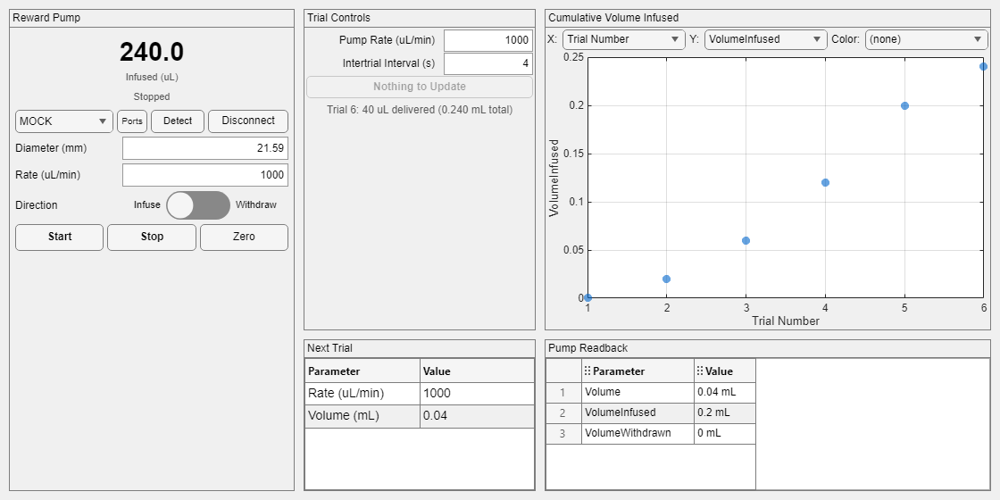

# Example: Testing the Syringe Pump Panel

The smallest complete session that exercises
[`gui.SyringePump`](../../documentation/gui/gui_SyringePump.md) the way a real
paradigm would: a protocol whose reward `Volume` steps through three levels,
a box GUI that embeds the pump panel beside the controls that write the same
pump, and a trial loop that dispenses on every trial.

Runs with **no hardware** — with no port given it builds against
`tmp/NE1000_Mock`, the in-process simulated pump the `hw.NE1000` smoke tests
use.

## Quick start

```matlab
addpath('examples/syringepump')

run_pump_session                       % simulated pump, 12 rewards
run_pump_session(Port = 'COM4')        % a real NE-1000 on COM4
create_pump_protocol                   % writes PumpExample.eprot for RunExpt
```



What to watch while it runs:

- the panel's readout climbing after each reward, and its status line turning
  green while the motor is running;
- **Next Trial** showing the reward size the runtime is about to write;
- the scatter and the monitor following `VolumeInfused` as it lands in `DATA`;
- **Start**, **Stop**, **Zero**, the port picker, and the right-click menu all
  still working by hand between trials, on the same pump the session is using.

## Files

| File | Purpose |
|---|---|
| `create_pump_protocol.m` | Builds and compiles the protocol: three reward volumes on the pump's own `Volume` parameter, a randomized ITI, the three core triggers |
| `PumpBoxGUI.m` | `gui.BoxGUI` subclass: the pump panel, trial controls, next-trial display, a `VolumeInfused` scatter and monitor |
| `run_pump_session.m` | Hardware-free session; mirrors the real runtime loop and pulses `Start` each trial |

Generated at runtime (not checked in): `PumpExample.eprot`.

## Three things this example exists to pin down

**The pump must be connected at design time.** `hw.NE1000` builds its
parameter table during the connect handshake, so an offline interface has no
`Volume` or `Rate` to compile into a trial table. `create_pump_protocol`
therefore builds against a live pump (real or simulated) and saves the result;
the `.eprot` reloads with an *offline* interface carrying that same table, so
`run_pump_session` rebuilds rather than loads — `epsych.Runtime` asserts that
every interface connects.

**Rate units are the panel's, not the protocol's.** `gui.SyringePump` puts the
interface into the units it displays (µL/min by default) when it attaches, so
the protocol is authored in those same units (`RateUnits = 'UM'`). Otherwise
the number the trial table re-asserts every trial and the number the operator
reads in the panel would be the same value in different units.

**Volume units follow the syringe, not the rate.** The pump reports volumes in
µL below a 14 mm diameter and mL at or above — independent of `RateUnits`.
`hw.NE1000` labels `Volume`, `VolumeInfused`, and `VolumeWithdrawn` from
`RateUnits`, so with µL/min and a 21.59 mm syringe every display fed by those
parameters reads `0.04 uL` for a 40 µL reward. `create_pump_protocol` corrects
the labels from the diameter. The panel's own readout is unaffected: it reads
`hw.NE1000.DispensedUnits`, which records what the pump actually said.

## Known issue this turned up

`hw.NE1000.transact_` is **not reentrancy-safe**, and the panel guarantees a
second agent on the interface: its readout timer issues a `DIS` every 250 ms
while the runtime is writing `Rate` and `Volume` from the trial table. A timer
callback that lands between an outer transaction's write and its read starts
with `flushInput_`, which discards the reply the outer command is waiting for —
so the outer read either times out (`NE1000: timed out waiting for a reply to
"RAT"`) or, worse on a real port, consumes the `DIS` reply and reports it as
the answer to `RAT`.

Measured against the mock with the panel polling at 20 Hz: **14 interleavings
in 548 dispatch cycles (~2.5 %)**, all of the form *outer `RAT`/`VOL`
interrupted by `DIS`*. A guard in `transact_` — serializing transactions and
having a poll that arrives mid-transaction fall back to the cached value —
would close it; the window is wider with a real serial port, not narrower,
because `readline` blocks on I/O.

## Related

- [documentation/gui/gui_SyringePump.md](../../documentation/gui/gui_SyringePump.md) — the panel
- [documentation/hw/hw_NE1000.md](../../documentation/hw/hw_NE1000.md) — the backend
- [examples/customgui/](../customgui/) — minimal `gui.BoxGUI` starter template
- [examples/detection_task/](../detection_task/) — the full worked experiment
- Validation: `tmp/smoke_test_syringepump_example.m` (headless;
  `matlab -batch "run('tmp/smoke_test_syringepump_example.m')"`), and
  `tmp/smoke_test_syringepump_gui.m` for the panel itself
